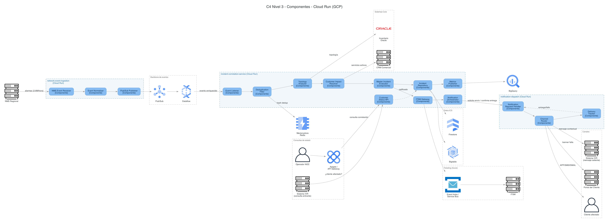

# Diagrama C4 - Nivel 3: Componentes (Cloud Run - GCP)

> Descompone en componentes los contenedores **Cloud Run** de la nube GCP
> definidos en el [diagrama de contenedores](c4_contenedores.md):
> `incident-correlation-service` (RF12), `network-event-ingestion` y
> `notification-dispatch`, según [`diagrama_arquitectura.md`](../diagrama_arquitectura.md) /
> [`diagrama_arquitectura.py`](../diagrama_arquitectura.py). Se profundiza especialmente en
> **incident-correlation-service** por ser el de mayor volumen y complejidad de correlación
> en tiempo real (2.6 M eventos/hora de red), tal como se anticipó en el diagrama de
> contenedores. Su lógica interna está tomada de
> [`microservicios/incident-correlation-service.md`](../microservicios/incident-correlation-service.md)
> y del [diagrama de secuencia RF12](../diagramas_secuencia/RF12_correlacion_incidente_red_cliente.md).

Este diagrama está disponible en dos formatos equivalentes:

- **Mermaid** (embebido más abajo, renderizable en GitHub/IDE).
- **Diagrams (Python)** con íconos oficiales de GCP para los contenedores Cloud Run y sus
  dependencias de datos: script
  [`diagrama_c4_componentes.py`](diagrama_c4_componentes.py) → imagen
  [`diagrama_c4_componentes.png`](diagrama_c4_componentes.png).
  Regenerar con: `pip install diagrams` (+ Graphviz) y `python3 diagrama_c4_componentes.py`.

## Versión Mermaid

```mermaid
C4Component
    title Diagrama de Componentes - Cloud Run (GCP) - Operación de Red y Analítica

    System_Ext(nms, "NMS Regional", "Alarmas de red física (2.6M eventos/hora)")
    System_Ext(oracle, "Inventario Oracle", "Nodos, CTOs, puertos, topología")
    System_Ext(crm, "CRM Comercial", "Clientes y servicios activos")
    System_Ext(itsm, "ITSM (Azure)", "Gestión de tickets de incidentes")
    System_Ext(ivr, "Sistema IVR", "Atención automática de llamadas")
    System_Ext(portal, "Portal del Cliente", "Banner de falla masiva")
    Person(noc, "Operador NOC", "Monitorea incidentes activos")
    Person(cliente, "Cliente afectado", "Recibe notificaciones proactivas")

    Container(agw, "Apigee / API Gateway", "Apigee", "Fachada API del canal NOC")
    ContainerDb(pubsub, "Pub/Sub", "Pub/Sub", "Eventos de red crudos y normalizados")
    Container(dataflow, "Dataflow", "Dataflow", "Normalización y enriquecimiento en streaming")
    ContainerDb(bigtable, "Bigtable", "Bigtable", "Series de tiempo de alarmas correlacionadas")
    ContainerDb(firestore, "Firestore", "Firestore", "Incidentes maestros y clientes afectados")
    ContainerDb(memstore, "Memorystore Redis", "Redis", "Caché de deduplicación y correlación")
    ContainerDb(bigquery, "BigQuery", "BigQuery", "Analítica consolidada")
    Container(eventhubs, "Event Hubs / Service Bus", "Azure", "Puente de eventos canónicos hacia Azure/ITSM")

    Container_Boundary(ingestion, "network-event-ingestion (Cloud Run)") {
        Component(nmsReceiver, "NMS Event Receiver", "Endpoint HTTP/gRPC", "Recibe eventos crudos de múltiples NMS")
        Component(normalizer, "Event Normalizer", "Servicio interno", "Normaliza y enriquece formato de eventos por fuente")
        Component(psPublisher, "Pub/Sub Publisher", "Adaptador saliente", "Publica eventos normalizados al tópico de red")
    }

    Container_Boundary(ics, "incident-correlation-service (Cloud Run)") {
        Component(eventListener, "Event Listener", "Pub/Sub subscriber", "Consume stream de eventos de red normalizados")
        Component(dedup, "Deduplication Filter", "Servicio interno", "Descarta alarmas duplicadas por hash (nodeId+alarmType+ventana)")
        Component(topology, "Topology Analyzer", "Servicio interno", "Mapea dependencias downstream y alcance geográfico")
        Component(customerResolver, "Customer Impact Resolver", "Servicio interno", "Identifica y clasifica clientes activos por tipo/SLA")
        Component(evaluator, "Master Incident Evaluator", "Servicio interno", "Aplica correlation_rules: umbral de clientes / infra crítica")
        Component(incidentRepo, "Incident Repository", "Repositorio", "Persiste master_incidents, correlated_alarms, affected_customers")
        Component(itsmGateway, "ITSM Gateway", "Adaptador saliente", "Crea incidente maestro y cierra tickets hijos en cascada")
        Component(notifOrchestrator, "Notification Orchestrator", "Servicio interno", "Arma notificación proactiva multicanal y prioriza por SLA")
        Component(inquiryApi, "Customer Status API", "API interna", "Responde si un cliente está afectado por incidente activo")
        Component(metricsPublisher, "Metrics Publisher", "Servicio interno", "Publica métricas de correlación y KPIs")
    }

    Container_Boundary(notif, "notification-dispatch (Cloud Run)") {
        Component(notifHandler, "Notification Request Handler", "API interna", "Recibe solicitudes de notificación proactiva")
        Component(channelRouter, "Channel Router", "Servicio interno", "Segmenta y enruta por canal (APP/SMS/EMAIL/IVR) y prioridad")
        Component(deliveryTracker, "Delivery Tracker", "Servicio interno", "Reintentos, estado de entrega y tasa de éxito")
    }

    Rel(nms, nmsReceiver, "Emite alarmas", "Cloud Interconnect")
    Rel(nmsReceiver, normalizer, "Entrega evento crudo")
    Rel(normalizer, psPublisher, "Entrega evento normalizado")
    Rel(psPublisher, pubsub, "Publica")

    Rel(pubsub, dataflow, "Procesa en streaming")
    Rel(dataflow, eventListener, "Entrega evento enriquecido")

    Rel(eventListener, dedup, "Pasa evento")
    Rel(dedup, memstore, "Verifica/actualiza hash")
    Rel(dedup, topology, "Evento único → analiza")
    Rel(topology, oracle, "Consulta topología", "Private Service Connect")
    Rel(topology, customerResolver, "Infraestructura afectada")
    Rel(customerResolver, crm, "Consulta servicios activos", "Private Service Connect")
    Rel(customerResolver, evaluator, "Clientes clasificados")
    Rel(evaluator, incidentRepo, "Persiste correlación")
    Rel(incidentRepo, firestore, "Lee/escribe incidentes")
    Rel(incidentRepo, bigtable, "Lee/escribe alarmas correlacionadas")
    Rel(evaluator, itsmGateway, "Incidente maestro calificado")
    Rel(itsmGateway, eventhubs, "Crea/cierra ticket")
    Rel(eventhubs, itsm, "Enruta a ITSM")
    Rel(itsmGateway, notifOrchestrator, "Incidente confirmado")
    BiRel(notifOrchestrator, notifHandler, "Solicita envío / confirma entrega")
    Rel(inquiryApi, incidentRepo, "Consulta cliente en incidente activo")
    Rel(ivr, inquiryApi, "¿Cliente afectado?")
    Rel(agw, inquiryApi, "Enruta consulta NOC/IVR")
    Rel(noc, agw, "Consulta correlación de incidentes")
    Rel(metricsPublisher, bigquery, "Publica métricas y KPIs")
    Rel(incidentRepo, metricsPublisher, "Emite evento de métricas")

    Rel(notifHandler, channelRouter, "Entrega solicitud segmentada")
    Rel(channelRouter, cliente, "Envía notificación", "APP/SMS/EMAIL")
    Rel(channelRouter, ivr, "Actualiza mensaje contextual")
    Rel(channelRouter, portal, "Muestra/remueve banner de falla")
    Rel(channelRouter, deliveryTracker, "Registra intento de envío")
    Rel(deliveryTracker, notifHandler, "Reporta entrega/fallo")

    UpdateLayoutConfig($c4ShapeInRow="3", $c4BoundaryInRow="1")
```

## Notas

- Los tres contenedores (`network-event-ingestion`, `incident-correlation-service`,
  `notification-dispatch`) corresponden 1:1 a los definidos en el
  [diagrama de contenedores](c4_contenedores.md); aquí se abren únicamente los que
  se ejecutan en **Cloud Run (GCP)**, siguiendo el pedido de foco en ese cómputo.
- `Dataflow` y `Pub/Sub` se mantienen como contenedores externos (no se descomponen)
  porque son servicios gestionados de GCP, no código propio del equipo.
- **ITSM (Azure)** se representa como sistema externo alcanzado a través del puente
  `Event Hubs ↔ Service Bus` ya documentado en el diagrama de contenedores; no es un
  contenedor nuevo, es el mismo backbone de eventos canónico visto desde el lado de
  `incident-correlation-service`.
- Se omiten, igual que en el diagrama de contenedores, los componentes puramente
  transversales de seguridad y observabilidad (Secret Manager, Cloud KMS, Cloud
  Monitoring/Logging) salvo `Metrics Publisher`, que sí es parte del comportamiento
  de negocio descrito en `correlation_metrics` (ver
  [`microservicios/incident-correlation-service.md`](../microservicios/incident-correlation-service.md)).
- El componente `Deduplication Filter` y el umbral de `Master Incident Evaluator`
  (`>100 clientes O >10 empresariales O infraestructura crítica`) están tomados
  directamente del algoritmo `CorrelacionarIncidentes` documentado en el microservicio.
- `network-event-ingestion` y `notification-dispatch` se muestran con un nivel de
  detalle menor (3 componentes cada uno) porque, a diferencia de
  `incident-correlation-service`, no tienen un documento de microservicio propio en
  `microservicios/`; su descomposición aquí es la única fuente de detalle interno
  disponible por ahora.
- **Layout del script Python:** el diagrama fluye estrictamente izquierda → derecha
  siguiendo el pipeline real (ingesta → correlación → persistencia/ITSM →
  notificación), y cada dependencia de datos se ubica junto al componente que la usa
  (p. ej. Memorystore justo debajo de `Deduplication Filter`, Firestore/Bigtable
  junto a `Incident Repository`) en vez de agruparse en un único bloque de "sistemas
  externos" — esto fue un rediseño explícito para eliminar los cruces de líneas
  largas de la primera versión.
- **Sistema IVR duplicado a propósito:** el IVR aparece dos veces en el diagrama
  Python (`Sistema IVR (consulta entrante)` junto a `Customer Status API`, y
  `Sistema IVR (mensaje saliente)` junto a `Channel Router`) porque es el mismo
  sistema externo tocado en dos puntos muy distantes del pipeline; duplicar el nodo
  evita una línea larga en zigzag y es una técnica estándar en diagramas C4/de
  arquitectura para actores/sistemas con múltiples puntos de contacto. La versión
  Mermaid sí usa un único nodo `ivr`, ya que su layout automático no sufre el mismo
  problema de cruces.
- El canal `Notification Orchestrator ↔ Notification Request Handler` se modela
  como una única relación bidireccional (solicitud de envío + confirmación de
  entrega), en vez de dos flechas separadas ida y vuelta, para evitar que el
  `entrega/fallo` de `Delivery Tracker` tuviera que cruzar de regreso todo el
  contenedor `incident-correlation-service`; en su lugar, `Delivery Tracker` reporta
  localmente a `Notification Request Handler` (mismo contenedor).
