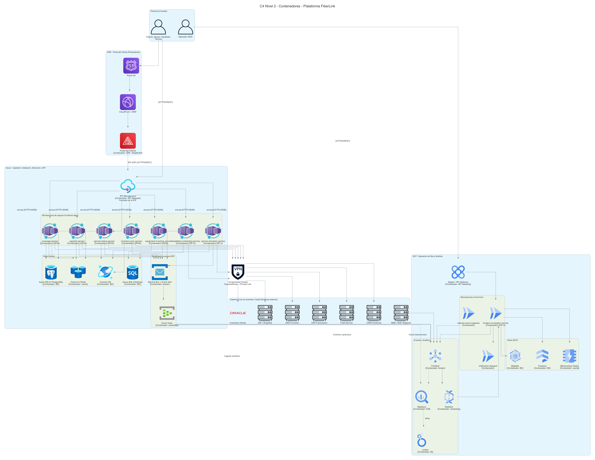

# Diagrama C4 - Nivel 2: Contenedores

> Descompone la Plataforma FiberLink (ver [contexto](c4_contexto.md)) en sus
> contenedores desplegables por nube, según
> [`diagrama_arquitectura.md`](../diagrama_arquitectura.md) /
> [`diagrama_arquitectura.py`](../diagrama_arquitectura.py) y la tabla
> "Mapeo Requerimiento → Microservicio → Nube": AWS aloja el **Portal del Cliente**
> (presentación), Azure concentra la **EIP** (API Management) y los 7 microservicios
> de captación/instalación/activación con sus datos, y GCP concentra la **operación
> de red y la analítica**.

Este diagrama está disponible en dos formatos equivalentes:

- **Mermaid** (embebido más abajo, renderizable en GitHub/IDE).
- **Diagrams (Python)** con íconos oficiales: script
  [`diagrama_c4_contenedores.py`](diagrama_c4_contenedores.py) → imagen
  [`diagrama_c4_contenedores.png`](diagrama_c4_contenedores.png).
  Regenerar con: `pip install diagrams` (+ Graphviz) y `python3 diagrama_c4_contenedores.py`.

## Versión Mermaid

```mermaid
C4Container
    title Diagrama de Contenedores - Plataforma FiberLink

    Person(usuarios, "Cliente, Asesor, Vendedor, Técnico", "Usuarios de canales")
    Person(noc, "Operador NOC", "Monitoreo de red e incidentes")

    Container_Boundary(aws, "AWS - Portal del Cliente (Presentación)") {
        Container(portal, "Portal del Cliente", "SPA - Amplify/S3 + CloudFront + WAF", "Landing, cobertura y seguimiento de solicitud")
    }

    Container_Boundary(azure, "Azure - Captación, Instalación, Activación y EIP") {
        Container(apim, "API Management", "Azure APIM", "Fachada de la EIP: enrutamiento, auth, rate limiting (INT-01)")

        Container(coverage, "coverage-service", "Container Apps", "RF03 - Consulta de cobertura")
        Container(capacity, "capacity-service", "Container Apps", "RF04 - Validación de capacidad")
        Container(status, "service-status-service", "Container Apps", "RF05 - Consulta de estado del servicio")
        Container(sync, "inventory-sync-service", "Container Apps", "RF06 - Sincronización de inventario de puertos")
        Container(equipment, "equipment-inventory-service", "Container Apps", "RF09 - Validación de inventario de equipos")
        Container(scheduling, "installation-scheduling-service", "Container Apps", "RF10 - Programación y reprogramación de instalación")
        Container(activation, "service-activation-service", "Container Apps", "RF11 - Activación del servicio")

        ContainerDb(pg, "Azure DB for PostgreSQL", "PostgreSQL", "Caché de cobertura/capacidad")
        ContainerDb(sql, "Azure SQL", "SQL Database", "Órdenes de instalación/activación")
        ContainerDb(cosmos, "Cosmos DB", "Cosmos DB", "Estado de servicio e inventario de equipos/puertos")
        ContainerDb(redis, "Cache for Redis", "Redis", "Caché de lecturas frecuentes")

        Container(servicebus, "Service Bus + Event Grid", "Azure Service Bus", "Backbone de eventos de negocio")
        Container(eventhubs, "Event Hubs", "Azure Event Hubs", "Streaming de eventos canónicos hacia GCP")
    }

    Container_Boundary(gcp, "GCP - Operación de Red y Analítica") {
        Container(agw, "Apigee / API Gateway", "Apigee", "Fachada API para el canal NOC")

        Container(incident, "incident-correlation-service", "Cloud Run", "RF12 - Correlación de incidentes de red")
        Container(ingestion, "network-event-ingestion", "Cloud Run", "Ingesta masiva de eventos de red (2.6M/hora)")
        Container(notify, "notification-dispatch", "Cloud Run", "Envío de notificaciones multicanal")

        Container(pubsub, "Pub/Sub", "Pub/Sub", "Eventos de red crudos y normalizados")
        Container(dataflow, "Dataflow", "Dataflow", "Normalización y enriquecimiento de eventos en streaming")

        ContainerDb(bigtable, "Bigtable", "Bigtable", "Series de tiempo de alarmas correlacionadas")
        ContainerDb(firestore, "Firestore", "Firestore", "Incidentes maestros y clientes afectados")
        ContainerDb(memstore, "Memorystore Redis", "Redis", "Caché de deduplicación y correlación")
        ContainerDb(bigquery, "BigQuery", "BigQuery", "Datos analíticos consolidados y trazabilidad")

        Container(looker, "Looker", "Looker", "Dashboards y KPIs")
    }

    System_Boundary(core, "Sistemas Core (on-premises / SaaS)") {
        System_Ext(crm, "CRM Comercial")
        System_Ext(oracle, "Inventario Oracle")
        System_Ext(gis, "GIS / Shapefile")
        System_Ext(oss, "OSS Provisión")
        System_Ext(erp, "ERP Facturación")
        System_Ext(fieldservice, "Field Service")
        System_Ext(nms, "NMS / NOC Regional")
    }

    Rel(usuarios, portal, "Navega", "HTTPS")
    Rel(portal, apim, "Consume APIs de negocio", "HTTPS/REST - API (EIP)")
    Rel(usuarios, apim, "App móvil / canales directos", "HTTPS/REST")
    Rel(noc, agw, "Consulta correlación de incidentes", "HTTPS/REST")

    Rel(apim, coverage, "Enruta", "HTTP/JSON")
    Rel(apim, capacity, "Enruta", "HTTP/JSON")
    Rel(apim, status, "Enruta", "HTTP/JSON")
    Rel(apim, sync, "Enruta", "HTTP/JSON")
    Rel(apim, equipment, "Enruta", "HTTP/JSON")
    Rel(apim, scheduling, "Enruta", "HTTP/JSON")
    Rel(apim, activation, "Enruta", "HTTP/JSON")
    Rel(agw, incident, "Enruta", "HTTP/JSON")

    Rel(coverage, redis, "Lee/escribe caché")
    Rel(coverage, pg, "Lee/escribe")
    Rel(capacity, redis, "Lee/escribe caché")
    Rel(capacity, pg, "Lee/escribe")
    Rel(status, redis, "Lee/escribe caché")
    Rel(status, cosmos, "Lee/escribe")
    Rel(scheduling, sql, "Lee/escribe")
    Rel(activation, sql, "Lee/escribe")
    Rel(equipment, cosmos, "Lee/escribe")
    Rel(sync, cosmos, "Lee/escribe")
    Rel(incident, bigtable, "Lee/escribe")
    Rel(incident, firestore, "Lee/escribe")
    Rel(incident, memstore, "Lee/escribe caché")

    Rel(coverage, servicebus, "Publica eventos de negocio")
    Rel(capacity, servicebus, "Publica eventos de negocio")
    Rel(status, servicebus, "Publica eventos de negocio")
    Rel(sync, servicebus, "Publica eventos de negocio")
    Rel(equipment, servicebus, "Publica eventos de negocio")
    Rel(scheduling, servicebus, "Publica eventos de negocio")
    Rel(activation, servicebus, "Publica eventos de negocio")
    Rel(servicebus, eventhubs, "Reenvía")
    Rel(eventhubs, pubsub, "Eventos canónicos", "bidireccional")
    Rel(ingestion, pubsub, "Publica eventos de red crudos")
    Rel(incident, pubsub, "Publica/consume eventos")
    Rel(pubsub, dataflow, "Procesa en streaming")
    Rel(dataflow, incident, "Entrega eventos normalizados")
    Rel(incident, notify, "Solicita notificación")

    Rel(eventhubs, bigquery, "Ingesta analítica", "asíncrono")
    Rel(pubsub, bigquery, "Ingesta analítica", "asíncrono")
    Rel(bigquery, looker, "KPIs", "asíncrono")

    Rel(coverage, oracle, "Conectividad híbrida (ExpressRoute/Private Link)")
    Rel(capacity, oracle, "Conectividad híbrida")
    Rel(status, oracle, "Conectividad híbrida")
    Rel(sync, oracle, "Conectividad híbrida")
    Rel(equipment, oracle, "Conectividad híbrida")
    Rel(scheduling, fieldservice, "Conectividad híbrida")
    Rel(activation, oss, "Conectividad híbrida")
    Rel(coverage, gis, "Conectividad híbrida")
    Rel(activation, erp, "Conectividad híbrida")
    Rel(scheduling, crm, "Conectividad híbrida")
    Rel(nms, pubsub, "Emite alarmas", "Cloud Interconnect")

    UpdateLayoutConfig($c4ShapeInRow="4", $c4BoundaryInRow="1")
```

## Notas

- Se omiten del diagrama los contenedores puramente transversales de seguridad y
  observabilidad (Key Vault, Azure Sentinel, Azure Monitor, Secret Manager, Cloud KMS,
  Cloud Armor, Managed Grafana) para mantener el foco en los contenedores que entregan
  funcionalidad de negocio — están descritos en la sección **"Capas transversales"** de
  [`diagrama_arquitectura.md`](../diagrama_arquitectura.md#capas-transversales) y
  representados en detalle en `diagrama_arquitectura.py`.
- Las relaciones de "conectividad híbrida" están simplificadas 1:1 aquí por
  legibilidad; en `diagrama_arquitectura.py` se modelan a través de un nodo compartido
  de ExpressRoute + Private Link (Azure) y Cloud Interconnect + Private Service Connect
  (GCP) — ver el mismo agrupamiento en
  [`diagrama_c4_contenedores.py`](diagrama_c4_contenedores.py).
- Cada microservicio de negocio es, a su vez, un contenedor candidato para un
  [diagrama de componentes](c4_componentes.md) propio; ese documento profundiza en
  **incident-correlation-service** (GCP Cloud Run) por ser el de mayor volumen y
  complejidad de correlación en tiempo real (2.6 M eventos/hora), con deduplicación,
  identificación de clientes afectados, decisión de incidente maestro, notificaciones
  proactivas multicanal y cierre en cascada de tickets.
