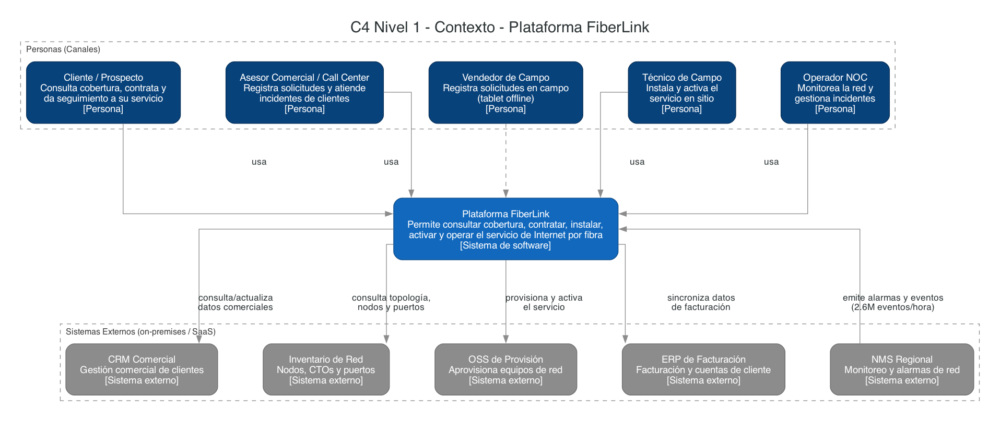
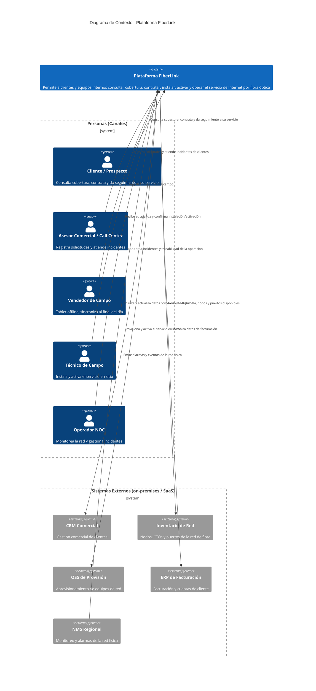

# Diagrama C4 - Nivel 1: Contexto del Sistema

> Deriva de [`diagrama_arquitectura.md`](../diagrama_arquitectura.md) /
> [`diagrama_arquitectura.py`](../diagrama_arquitectura.py), pero a propósito **no**
> reproduce su contenido: un diagrama de contexto es el nivel más alto de abstracción
> de un sistema y solo debe mostrar cómo el sistema en foco interactúa con actores y
> sistemas externos, sin exponer su implementación interna. Por eso la **Plataforma
> FiberLink** aparece aquí como una única caja definida por su propósito de negocio
> (captación, instalación, activación y operación del servicio de fibra); qué nube
> aloja cada parte, qué es la EIP o cuáles son los microservicios se resuelve recién
> en el [diagrama de contenedores](c4_contenedores.md).

Este diagrama está disponible en dos formatos equivalentes:

- **Mermaid** (embebido más abajo, renderizable en GitHub/IDE).
- **Diagrams (Python)** con la paleta de color estándar del modelo C4
  (persona/sistema/sistema externo, sin íconos de producto — a este nivel de
  abstracción no corresponden): script
  [`diagrama_c4_contexto.py`](diagrama_c4_contexto.py) → imagen
  [`diagrama_c4_contexto.png`](diagrama_c4_contexto.png).
  Regenerar con: `pip install diagrams` (+ Graphviz) y `python3 diagrama_c4_contexto.py`.

## Versión Mermaid

## Notas

- Deliberadamente **no aparecen** en este diagrama: nombres de nube (AWS/Azure/GCP),
  la EIP, microservicios, bases de datos ni protocolos de integración — eso es detalle
  de implementación y corresponde al [diagrama de contenedores](c4_contenedores.md). El
  contexto solo debe responder "¿con quién interactúa el sistema y para qué?".
- Los **sistemas externos** (CRM, Inventario de Red, OSS, ERP, NMS) son los mismos
  listados en la tabla "Distribución por nube" y el clúster `CORE` de
  `diagrama_arquitectura.md`, renombrados aquí por su rol de negocio en vez de su
  nombre de producto (p. ej. "Inventario Oracle" → "Inventario de Red").
- Se excluyen deliberadamente de este diagrama **GIS**, **Field Service** y el
  **Proveedor de Identidad**: siguen existiendo como sistemas externos/SaaS en
  `diagrama_arquitectura.md` y en el [diagrama de contenedores](c4_contenedores.md),
  pero no se representan en este nivel de contexto.
