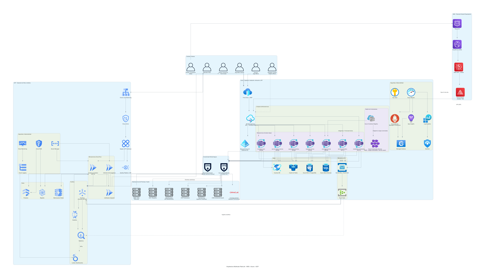

# Diagrama de Arquitectura Multinube - FiberLink Andina Telecom

> Arquitectura de alto nivel orientada a eventos y gobernada por una **Plataforma de Integración
> Empresarial (EIP / iPaaS)**, que elimina las integraciones punto a punto entre sistemas core
> (INT-07). El grueso de los microservicios se distribuye entre **Azure y GCP**; el **Portal del
> Cliente se aloja en AWS** como capa de presentación (CDN + hosting estático), consumiendo la EIP.

## Distribución por nube (criterio)

| Nube | Fase de la cadena de valor | Motivo principal |
|------|----------------------------|------------------|
| **AWS** | Portal del Cliente (capa de presentación) | Aloja el front del portal web (hosting estático + CDN + WAF). No ejecuta lógica de negocio: la SPA consume las APIs de la EIP en Azure. |
| **Azure** | Captación (consultas), instalación y activación + EIP | Concentra todos los flujos de negocio y de autoservicio: consultas de cobertura/capacidad/estado y la orquestación transaccional de instalación/activación. Las órdenes viven en Azure SQL y Azure API Management actúa como fachada de la EIP. |
| **GCP** | Operación de red y analítica | Los eventos de red ya se envían a Pub/Sub; concentra la ingesta masiva (2.6 M eventos/hora), la correlación de incidentes y la analítica consolidada en BigQuery + Looker. |

> **Nota de migración:** el Portal del Cliente se **movió a AWS** (Route 53 + CloudFront/WAF +
> Amplify). El resto de componentes de negocio permanece en Azure y la operación de red/analítica
> en GCP. La SPA del portal se sirve desde AWS y realiza las llamadas de datos contra **Azure API
> Management (EIP)**; la autenticación de cliente federa con **Entra ID (External ID)**.

## Mapeo Requerimiento → Microservicio → Nube

| RF | Microservicio | Nube | Cómputo |
|----|---------------|------|---------|
| RF03 Consultar cobertura | `coverage-service` | Azure | Container Apps |
| RF04 Validar capacidad | `capacity-service` | Azure | Container Apps |
| RF05 Consultar estado | `service-status-service` | Azure | Container Apps |
| RF06 Sincronizar inventario de puertos | `inventory-sync-service` | Azure | Container Apps |
| RF09 Validar inventario de equipos | `equipment-inventory-service` | Azure | Container Apps |
| RF10 Reprogramar instalación | `installation-scheduling-service` | Azure | Container Apps |
| RF11 Activar servicio | `service-activation-service` | Azure | Container Apps |
| RF12 Correlacionar incidentes | `incident-correlation-service` | GCP | Cloud Run |
| — Portal del Cliente (front) | `customer-portal` (SPA) | AWS | Amplify / S3 + CloudFront |

## Diagrama de Arquitectura (Architecture Diagram)

Este diagrama está disponible en dos formatos equivalentes:

- **Mermaid** (embebido más abajo, renderizable en GitHub/IDE).
- **Diagrams (Python)** con íconos oficiales de cada nube: script
  [`diagrama_arquitectura.py`](diagrama_arquitectura.py) → imagen
  [`diagrama_arquitectura.png`](diagrama_arquitectura.png).
  Regenerar con: `pip install diagrams` (+ Graphviz) y `python3 diagrama_arquitectura.py`.

> Para la vista C4 (Contexto → Contenedores → Componentes) derivada de este diagrama,
> ver [`c4/README.md`](c4/README.md).

### Versión Mermaid

```mermaid
flowchart TB
    %% ================= CANALES =================
    subgraph CH["Canales y Actores"]
        direction LR
        U1["Cliente / Prospecto (Web)"]:::channel
        U2["App Movil Cliente"]:::channel
        U3["Asesor Comercial / Call Center"]:::channel
        U4["Vendedor Campo (Tablet offline)"]:::channel
        U5["Tecnico (App Movil)"]:::channel
        U6["Operador NOC"]:::channel
    end

    %% ================= AWS =================
    subgraph AWS["AWS  -  Portal del Cliente (Presentacion)"]
        direction TB
        aR53["Route 53"]:::aws
        aCF["CloudFront + WAF + Shield"]:::aws
        aPortal["Portal Cliente (Amplify / S3)"]:::aws
    end

    %% ================= AZURE =================
    subgraph AZ["Azure  -  Captacion, Instalacion, Activacion y EIP"]
        direction TB
        zFD["Front Door + WAF"]:::azure
        zEID["Microsoft Entra ID (External ID)"]:::azure
        zAPIM["API Management  (EIP - Fachada API)"]:::azure
        subgraph AZ_MS["Microservicios (Container Apps)"]
            direction LR
            msCov["coverage-service (RF03)"]:::azure
            msCap["capacity-service (RF04)"]:::azure
            msSt["service-status-service (RF05)"]:::azure
            msSync["inventory-sync (RF06)"]:::azure
            msEq["equipment-inventory (RF09)"]:::azure
            msSch["installation-scheduling (RF10)"]:::azure
            msAct["service-activation (RF11)"]:::azure
        end
        zPG["Azure DB for PostgreSQL"]:::azure
        zSQL["Azure SQL (Ordenes)"]:::azure
        zCos["Cosmos DB"]:::azure
        zRedis["Cache for Redis"]:::azure
        zSB["Service Bus + Event Grid"]:::azure
        zEH["Event Hubs"]:::azure
        zKV["Key Vault"]:::azure
        zObs["Azure Monitor + App Insights + Sentinel"]:::azure
    end

    %% ================= GCP =================
    subgraph GCP["GCP  -  Operacion de Red y Analitica"]
        direction TB
        gLB["Cloud LB + Cloud Armor"]:::gcp
        gAGW["Apigee / API Gateway"]:::gcp
        gIDP["Identity Platform / IAP"]:::gcp
        subgraph GCP_MS["Microservicios (Cloud Run)"]
            direction LR
            msInc["incident-correlation (RF12)"]:::gcp
            msIngest["network-event-ingestion"]:::gcp
            msNotif["notification-dispatch"]:::gcp
        end
        gPS["Pub/Sub (Eventos de Red)"]:::gcp
        gDF["Dataflow"]:::gcp
        gBT["Bigtable"]:::gcp
        gFS["Firestore"]:::gcp
        gMem["Memorystore Redis"]:::gcp
        gBQ["BigQuery"]:::gcp
        gLook["Looker (Dashboards)"]:::gcp
        gSec["Secret Manager + Cloud KMS"]:::gcp
        gObs["Cloud Monitoring / Logging / Trace + Grafana"]:::gcp
    end

    %% ================= CONECTIVIDAD HIBRIDA =================
    subgraph NET["Conectividad Hibrida Segura (SEG-10)"]
        direction LR
        netAZ["Azure ExpressRoute + Private Link"]:::azure
        netGCP["Cloud Interconnect + Private Service Connect"]:::gcp
    end

    %% ================= SISTEMAS CORE =================
    subgraph CORE["Sistemas Core (On-Premises / SaaS)"]
        direction LR
        cCRM["CRM Comercial (SaaS)"]:::onprem
        cOra["Inventario Oracle (Nodos/CTO/Puertos)"]:::onprem
        cGIS["GIS / Shapefile"]:::onprem
        cOSS["OSS Provision (OLT/BRAS/Auth)"]:::onprem
        cERP["ERP Facturacion"]:::onprem
        cFS["Field Service (Agenda Cuadrillas)"]:::onprem
        cNMS["NMS / NOC (Alarmas)"]:::onprem
    end

    %% ---------- Flujos de canal ----------
    U1 --> aR53 --> aCF --> aPortal
    aPortal -- "API (EIP)" --> zAPIM
    U2 --> zFD
    U3 --> zFD
    U4 -. "Sync fin de dia" .-> zAPIM
    U5 --> zFD
    U6 --> gLB

    zFD --> zAPIM
    zAPIM --> zEID
    zAPIM --> msCov & msCap & msSt & msSync & msEq & msSch & msAct
    gLB --> gAGW
    gAGW --> gIDP
    gAGW --> msInc

    %% ---------- Datos por microservicio ----------
    msCov --> zRedis
    msCov --> zPG
    msCap --> zRedis
    msCap --> zPG
    msSt --> zRedis
    msSt --> zCos
    msSch --> zSQL
    msAct --> zSQL
    msEq --> zCos
    msSync --> zCos
    msInc --> gBT
    msInc --> gFS
    msInc --> gMem

    %% ---------- Backbone de eventos canonico (EIP) ----------
    msCov & msCap & msSt & msSync & msEq & msSch & msAct --> zSB --> zEH
    msIngest --> gPS
    msInc --> gPS
    zEH <== "Eventos canonicos" ==> gPS

    %% ---------- Acceso a core via conectividad hibrida (mediado por EIP) ----------
    msCov --> netAZ
    msCap --> netAZ
    msSt --> netAZ
    msSync --> netAZ
    msAct --> netAZ
    msSch --> netAZ
    msEq --> netAZ
    netAZ --> cCRM
    netAZ --> cOra
    netAZ --> cGIS
    netAZ --> cOSS
    netAZ --> cERP
    netAZ --> cFS

    %% ---------- Flujo de operacion de red ----------
    cNMS --> netGCP --> gPS
    gPS --> gDF --> msInc
    gPS --> gBQ
    gDF --> gBQ
    msInc --> msNotif
    msNotif --> U3
    msNotif --> U6

    %% ---------- Analitica ----------
    zEH -. "Ingesta analitica" .-> gBQ
    gBQ -. "KPIs" .-> gLook

    %% ================= ESTILOS =================
    classDef aws fill:#FF9900,stroke:#232F3E,color:#232F3E;
    classDef azure fill:#0078D4,stroke:#ffffff,color:#ffffff;
    classDef gcp fill:#1A73E8,stroke:#ffffff,color:#ffffff;
    classDef onprem fill:#5A6470,stroke:#ffffff,color:#ffffff;
    classDef channel fill:#EAEDED,stroke:#232F3E,color:#232F3E;
```

## Capas transversales

- **Seguridad (SEG-01..SEG-11 / RNOF02):** WAF + DDoS en cada borde (AWS WAF/Shield en el portal,
  Azure WAF/DDoS, Cloud Armor), autenticación federada (Entra ID External ID / Identity Platform)
  con OAuth2/OIDC + JWT, secretos en Key Vault / Secret Manager, cifrado en reposo (Key Vault-KMS /
  Cloud KMS) y en tránsito (TLS 1.2+), y `rate limiting` por tipo de operación en cada API Gateway.
- **Observabilidad (OBS-01..OBS-07):** logs estructurados y trazas distribuidas (Application
  Insights / Cloud Trace) correlacionadas por `correlationId`/`traceId` end-to-end; dashboards por
  consumidor (NOC, Soporte, Operación, Arquitectura) unificados en Grafana gestionado.
- **Integración (INT-01..INT-08):** APIs REST versionadas y documentadas con OpenAPI, backbone de
  eventos canónico entre **Event Hubs ↔ Pub/Sub**, idempotencia y `circuit breaker` en llamadas a
  sistemas core, y evidencias de intercambio para trazabilidad y auditoría.

## Leyenda

- 🟧 **AWS** &nbsp; 🟦 **Azure** &nbsp; 🔵 **GCP** &nbsp; ⬛ **Core On-Premises / SaaS** &nbsp; ⬜ **Canales**
- `<==>` Backbone de eventos canónico entre nubes · `-.->` Flujo asíncrono / analítico · `-->` Flujo síncrono
