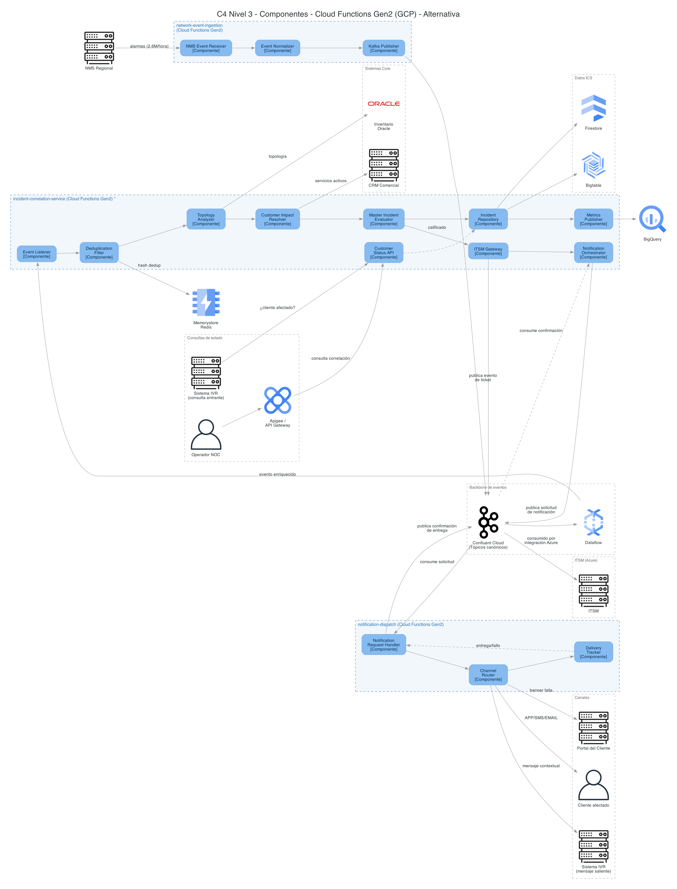

# Diagrama C4 - Nivel 3: Componentes (Arquitectura Alternativa - Cloud Functions Gen2)

> Descompone en componentes los contenedores **Cloud Functions Gen2** de GCP definidos en el
> [diagrama de contenedores](c4_contenedores.md) de esta alternativa:
> `incident-correlation-service` (RF12), `network-event-ingestion` y `notification-dispatch`,
> según [`diagrama_arquitectura_alternativa.md`](../diagrama_arquitectura_alternativa.md) /
> [`diagrama_arquitectura_alternativa.py`](../diagrama_arquitectura_alternativa.py). Igual que en
> la [versión vigente](../../c4/c4_componentes.md), se profundiza especialmente en
> **incident-correlation-service** por ser el de mayor volumen y complejidad de correlación en
> tiempo real (2.6 M eventos/hora de red). Su lógica interna sigue siendo la misma descrita en
> [`../microservicios/incident-correlation-service.md`](../../microservicios/incident-correlation-service.md)
> y el [diagrama de secuencia RF12](../../diagramas_secuencia/RF12_correlacion_incidente_red_cliente.md)
> — la alternativa **no cambia el algoritmo de correlación**, solo cómo los tres contenedores se
> despliegan y se comunican entre sí.

## Qué cambia respecto a la versión vigente

| Aspecto | Vigente ([`../../c4/c4_componentes.md`](../../c4/c4_componentes.md)) | Alternativa |
|---|---|---|
| Cómputo de los 3 contenedores | Cloud Run | **Cloud Functions Gen2** |
| Backbone de mensajería | Pub/Sub (GCP) | **Confluent Cloud (Kafka)** — mismo tópico canónico usado por Azure |
| Puente hacia ITSM (Azure) | Event Hubs ↔ Service Bus | El mismo tópico Kafka; un consumidor en Azure lo enruta a ITSM (ya no hay dos tecnologías de bus) |
| `Notification Orchestrator` → `Notification Request Handler` | Llamada directa bidireccional entre contenedores | **Publica/consume vía Kafka** (async): se desacopla `incident-correlation-service` de `notification-dispatch` |
| Deduplicación, topología, resolución de clientes, evaluador, repositorio, métricas | Sin cambios | Sin cambios (mismo algoritmo, misma dependencia de Memorystore/Firestore/Bigtable/CRM/Oracle) |

Este diagrama está disponible en dos formatos equivalentes:

- **Mermaid** (embebido más abajo, renderizable en GitHub/IDE).
- **Diagrams (Python)** con íconos oficiales de GCP para los contenedores Cloud Functions y sus
  dependencias de datos: script
  [`diagrama_c4_componentes.py`](diagrama_c4_componentes.py) → imagen
  [`diagrama_c4_componentes.png`](diagrama_c4_componentes.png).
  Regenerar con: `pip install diagrams` (+ Graphviz) y `python3 diagrama_c4_componentes.py`.

## Versión Mermaid

```mermaid
C4Component
    title Diagrama de Componentes - Cloud Functions Gen2 (GCP) - Arquitectura Alternativa

    System_Ext(nms, "NMS Regional", "Alarmas de red física (2.6M eventos/hora)")
    System_Ext(oracle, "Inventario Oracle", "Nodos, CTOs, puertos, topología")
    System_Ext(crm, "CRM Comercial", "Clientes y servicios activos")
    System_Ext(itsm, "ITSM (Azure)", "Gestión de tickets de incidentes")
    System_Ext(ivr, "Sistema IVR", "Atención automática de llamadas")
    System_Ext(portal, "Portal del Cliente", "Banner de falla masiva")
    Person(noc, "Operador NOC", "Monitorea incidentes activos")
    Person(cliente, "Cliente afectado", "Recibe notificaciones proactivas")

    Container(agw, "Apigee / API Gateway", "Apigee", "Fachada API del canal NOC")
    ContainerDb(kconf, "Confluent Cloud", "Kafka", "Backbone único de eventos de negocio y de red")
    Container(dataflow, "Dataflow", "Dataflow", "Normalización y enriquecimiento en streaming (lee de Kafka)")
    ContainerDb(bigtable, "Bigtable", "Bigtable", "Series de tiempo de alarmas correlacionadas")
    ContainerDb(firestore, "Firestore", "Firestore", "Incidentes maestros y clientes afectados")
    ContainerDb(memstore, "Memorystore Redis", "Redis", "Caché de deduplicación y correlación")
    ContainerDb(bigquery, "BigQuery", "BigQuery", "Analítica consolidada")

    Container_Boundary(ingestion, "network-event-ingestion (Cloud Functions Gen2)") {
        Component(nmsReceiver, "NMS Event Receiver", "Endpoint HTTP/gRPC", "Recibe eventos crudos de múltiples NMS")
        Component(normalizer, "Event Normalizer", "Servicio interno", "Normaliza y enriquece formato de eventos por fuente")
        Component(kPublisher, "Kafka Publisher", "Adaptador saliente", "Publica eventos normalizados al tópico de red")
    }

    Container_Boundary(ics, "incident-correlation-service (Cloud Functions Gen2) *") {
        Component(eventListener, "Event Listener", "Kafka consumer", "Consume stream de eventos de red normalizados")
        Component(dedup, "Deduplication Filter", "Servicio interno", "Descarta alarmas duplicadas por hash (nodeId+alarmType+ventana)")
        Component(topology, "Topology Analyzer", "Servicio interno", "Mapea dependencias downstream y alcance geográfico")
        Component(customerResolver, "Customer Impact Resolver", "Servicio interno", "Identifica y clasifica clientes activos por tipo/SLA")
        Component(evaluator, "Master Incident Evaluator", "Servicio interno", "Aplica correlation_rules: umbral de clientes / infra crítica")
        Component(incidentRepo, "Incident Repository", "Repositorio", "Persiste master_incidents, correlated_alarms, affected_customers")
        Component(itsmGateway, "ITSM Gateway", "Adaptador saliente", "Publica evento de creación/cierre de ticket maestro")
        Component(notifOrchestrator, "Notification Orchestrator", "Servicio interno", "Arma notificación proactiva multicanal y prioriza por SLA")
        Component(inquiryApi, "Customer Status API", "API interna", "Responde si un cliente está afectado por incidente activo")
        Component(metricsPublisher, "Metrics Publisher", "Servicio interno", "Publica métricas de correlación y KPIs")
    }

    Container_Boundary(notif, "notification-dispatch (Cloud Functions Gen2)") {
        Component(notifHandler, "Notification Request Handler", "Kafka consumer", "Consume solicitudes de notificación proactiva")
        Component(channelRouter, "Channel Router", "Servicio interno", "Segmenta y enruta por canal (APP/SMS/EMAIL/IVR) y prioridad")
        Component(deliveryTracker, "Delivery Tracker", "Servicio interno", "Reintentos, estado de entrega y tasa de éxito")
    }

    Rel(nms, nmsReceiver, "Emite alarmas", "Cloud Interconnect")
    Rel(nmsReceiver, normalizer, "Entrega evento crudo")
    Rel(normalizer, kPublisher, "Entrega evento normalizado")
    Rel(kPublisher, kconf, "Publica")

    Rel(kconf, dataflow, "Procesa en streaming")
    Rel(dataflow, eventListener, "Entrega evento enriquecido")

    Rel(eventListener, dedup, "Pasa evento")
    Rel(dedup, memstore, "Verifica/actualiza hash")
    Rel(dedup, topology, "Evento único → analiza")
    Rel(topology, oracle, "Consulta topología", "Private Service Connect")
    Rel(topology, customerResolver, "Infraestructura afectada")
    Rel(customerResolver, crm, "Consulta servicios activos", "Private Service Connect")
    Rel(customerResolver, evaluator, "Clientes clasificados")
    Rel(evaluator, incidentRepo, "Persiste correlación")
    Rel(incidentRepo, firestore, "Lee/escribe incidentes")
    Rel(incidentRepo, bigtable, "Lee/escribe alarmas correlacionadas")
    Rel(evaluator, itsmGateway, "Incidente maestro calificado")
    Rel(itsmGateway, kconf, "Publica evento de ticket")
    Rel(kconf, itsm, "Consumido por integración Azure → ITSM")
    Rel(itsmGateway, notifOrchestrator, "Incidente confirmado")
    Rel(notifOrchestrator, kconf, "Publica solicitud de notificación")
    Rel(kconf, notifHandler, "Consume solicitud")
    Rel(inquiryApi, incidentRepo, "Consulta cliente en incidente activo")
    Rel(ivr, inquiryApi, "¿Cliente afectado?")
    Rel(agw, inquiryApi, "Enruta consulta NOC/IVR")
    Rel(noc, agw, "Consulta correlación de incidentes")
    Rel(metricsPublisher, bigquery, "Publica métricas y KPIs")
    Rel(incidentRepo, metricsPublisher, "Emite evento de métricas")

    Rel(notifHandler, channelRouter, "Entrega solicitud segmentada")
    Rel(channelRouter, cliente, "Envía notificación", "APP/SMS/EMAIL")
    Rel(channelRouter, ivr, "Actualiza mensaje contextual")
    Rel(channelRouter, portal, "Muestra/remueve banner de falla")
    Rel(channelRouter, deliveryTracker, "Registra intento de envío")
    Rel(deliveryTracker, notifHandler, "Reporta entrega/fallo")
    Rel(notifHandler, kconf, "Publica confirmación de entrega")
    Rel(kconf, notifOrchestrator, "Consume confirmación")

    UpdateLayoutConfig($c4ShapeInRow="3", $c4BoundaryInRow="1")
```

## Notas

- `*` `incident-correlation-service` procesa 2.6M eventos/hora de forma sostenida; ver la
  recomendación de mantenerlo en Cloud Run si el volumen genera cold starts, documentada en
  [`diagrama_arquitectura_alternativa.md`](../diagrama_arquitectura_alternativa.md#riesgos--trade-offs).
- **`Pub/Sub` desaparece como contenedor propio de GCP**: el único backbone de mensajería es
  ahora `Confluent Cloud` (Kafka), el mismo que usan los microservicios de Azure — por eso se
  modela como `ContainerDb` en el diagrama en vez de un contenedor específico de GCP, igual
  criterio que se usó para `Pub/Sub`/`Event Hubs` en la versión vigente.
- **El puente a ITSM ya no pasa por Event Hubs/Service Bus**: `ITSM Gateway` publica el evento
  de ticket directamente en el tópico Kafka; un consumidor del lado Azure (fuera del alcance de
  este componente, documentado en el [diagrama de contenedores](c4_contenedores.md)) lo enruta a
  ITSM. Es el mismo patrón "un solo backbone" aplicado también a esta integración puntual.
- **Cambio de comportamiento clave — `Notification Orchestrator` ↔ `Notification Request
  Handler`**: en la versión vigente esta relación es una llamada directa bidireccional entre dos
  contenedores. En la alternativa, ambos componentes solo publican/consumen del tópico Kafka:
  `incident-correlation-service` no bloquea su flujo esperando la confirmación de
  `notification-dispatch`, y viceversa. Esto es la aplicación concreta, a nivel de componentes,
  del principio de "comunicación asíncrona por defecto" ya establecido en
  [`diagrama_arquitectura_alternativa.md`](../diagrama_arquitectura_alternativa.md#resumen-ejecutivo).
- Los componentes internos de `incident-correlation-service` (`Deduplication Filter`,
  `Topology Analyzer`, `Customer Impact Resolver`, `Master Incident Evaluator`,
  `Incident Repository`, `Metrics Publisher`) **no cambian**: el algoritmo de correlación, sus
  contratos y el umbral (`>100 clientes O >10 empresariales O infraestructura crítica`) siguen
  siendo los de
  [`../microservicios/incident-correlation-service.md`](../../microservicios/incident-correlation-service.md).
  El cambio de Cloud Run a Cloud Functions Gen2 es un cambio de *runtime*, no de *diseño interno*
  — es compatible porque estos componentes ya delegaban su estado a servicios externos
  (Memorystore, Firestore, Bigtable) en vez de mantener estado en memoria del contenedor.
- `network-event-ingestion` y `notification-dispatch` mantienen el mismo nivel de detalle menor
  (3 componentes cada uno) que en la versión vigente, por la misma razón: no tienen documento de
  microservicio propio en `microservicios/`.
- **Sistema IVR duplicado a propósito** (igual que en la versión vigente): aparece dos veces en
  el diagrama Python para evitar una línea larga en zigzag entre `Customer Status API` y
  `Channel Router`, que están en extremos opuestos del pipeline.
