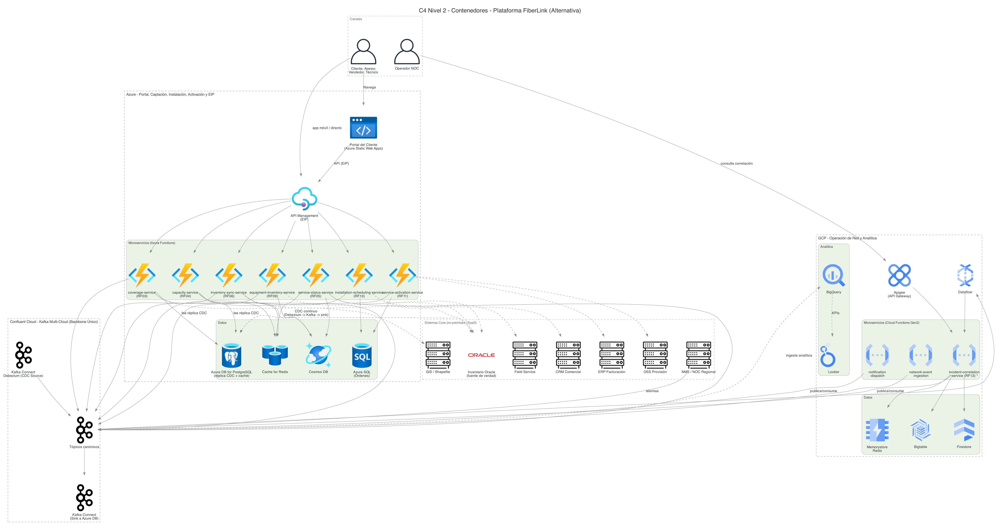

# Diagrama C4 - Nivel 2: Contenedores (Arquitectura Alternativa)

> Descompone la Plataforma FiberLink (ver [contexto](c4_contexto.md)) en sus contenedores
> desplegables, según [`diagrama_arquitectura_alternativa.md`](../diagrama_arquitectura_alternativa.md) /
> [`diagrama_arquitectura_alternativa.py`](../diagrama_arquitectura_alternativa.py). Frente al
> [diagrama de contenedores vigente](../../c4/c4_contenedores.md), esta versión combina 4 ejes:
> **Azure concentra también el Portal del Cliente** (se elimina AWS), los 7 microservicios de
> negocio y el de correlación de incidentes pasan a **cómputo serverless** (Azure Functions /
> Cloud Functions Gen2), el puente Service Bus/Event Hubs↔Pub/Sub se reemplaza por un **backbone
> único Confluent Cloud (Kafka)**, y el Inventario de Red se **replica vía CDC** hacia Azure en
> vez de consultarse en vivo.

Este diagrama está disponible en dos formatos equivalentes:

- **Mermaid** (embebido más abajo, renderizable en GitHub/IDE).
- **Diagrams (Python)** con íconos oficiales: script
  [`diagrama_c4_contenedores.py`](diagrama_c4_contenedores.py) → imagen
  [`diagrama_c4_contenedores.png`](diagrama_c4_contenedores.png).
  Regenerar con: `pip install diagrams` (+ Graphviz) y `python3 diagrama_c4_contenedores.py`.

## Versión Mermaid

```mermaid
C4Container
    title Diagrama de Contenedores - Plataforma FiberLink (Arquitectura Alternativa)

    Person(usuarios, "Cliente, Asesor, Vendedor, Técnico", "Usuarios de canales")
    Person(noc, "Operador NOC", "Monitoreo de red e incidentes")

    Container_Boundary(azure, "Azure - Portal del Cliente, Captación, Instalación, Activación y EIP") {
        Container(portal, "Portal del Cliente", "SPA - Azure Static Web Apps + Front Door + WAF", "Landing, cobertura y seguimiento de solicitud")
        Container(apim, "API Management", "Azure APIM", "Fachada de la EIP: enrutamiento, auth, rate limiting (INT-01)")

        Container(coverage, "coverage-service", "Azure Functions", "RF03 - Consulta de cobertura (lee réplica CDC, no Oracle en vivo)")
        Container(capacity, "capacity-service", "Azure Functions", "RF04 - Validación de capacidad (lee réplica CDC, no Oracle en vivo)")
        Container(status, "service-status-service", "Azure Functions", "RF05 - Consulta de estado del servicio")
        Container(sync, "inventory-sync-service", "Azure Functions", "RF06 - Sincronización de inventario de puertos")
        Container(equipment, "equipment-inventory-service", "Azure Functions", "RF09 - Validación de inventario de equipos")
        Container(scheduling, "installation-scheduling-service", "Azure Functions", "RF10 - Programación y reprogramación de instalación")
        Container(activation, "service-activation-service", "Azure Functions", "RF11 - Activación del servicio")

        ContainerDb(pg, "Azure DB for PostgreSQL", "PostgreSQL", "Réplica CDC de inventario (nodos/CTO/puertos) + caché de cobertura/capacidad")
        ContainerDb(sql, "Azure SQL", "SQL Database", "Órdenes de instalación/activación")
        ContainerDb(cosmos, "Cosmos DB", "Cosmos DB", "Estado de servicio e inventario de equipos/puertos")
        ContainerDb(redis, "Cache for Redis", "Redis", "Caché de lecturas frecuentes")
    }

    Container_Boundary(kafka, "Confluent Cloud - Kafka Multi-Cloud (Backbone Único de Eventos)") {
        Container(kconf, "Tópicos canónicos", "Kafka", "Backbone único de eventos de negocio y de red (reemplaza Service Bus/Event Hubs/Pub-Sub)")
        Container(kcdcsrc, "Kafka Connect - Debezium", "Kafka Connect", "CDC source: captura cambios del Inventario Oracle")
        Container(kcdcsink, "Kafka Connect Sink", "Kafka Connect", "Materializa los cambios capturados en Azure DB for PostgreSQL")
    }

    Container_Boundary(gcp, "GCP - Operación de Red y Analítica") {
        Container(agw, "Apigee / API Gateway", "Apigee", "Fachada API para el canal NOC")

        Container(incident, "incident-correlation-service", "Cloud Functions Gen2", "RF12 - Correlación de incidentes de red *")
        Container(ingestion, "network-event-ingestion", "Cloud Functions Gen2", "Ingesta masiva de eventos de red (2.6M/hora)")
        Container(notify, "notification-dispatch", "Cloud Functions Gen2", "Envío de notificaciones multicanal (activado por eventos Kafka)")

        Container(dataflow, "Dataflow", "Dataflow", "Normalización y enriquecimiento de eventos en streaming (lee de Kafka)")

        ContainerDb(bigtable, "Bigtable", "Bigtable", "Series de tiempo de alarmas correlacionadas")
        ContainerDb(firestore, "Firestore", "Firestore", "Incidentes maestros y clientes afectados")
        ContainerDb(memstore, "Memorystore Redis", "Redis", "Caché de deduplicación y correlación")
        ContainerDb(bigquery, "BigQuery", "BigQuery", "Datos analíticos consolidados y trazabilidad")

        Container(looker, "Looker", "Looker", "Dashboards y KPIs")
    }

    System_Boundary(core, "Sistemas Core (on-premises / SaaS)") {
        System_Ext(crm, "CRM Comercial")
        System_Ext(oracle, "Inventario Oracle", "Fuente de verdad; replicado vía CDC")
        System_Ext(gis, "GIS / Shapefile")
        System_Ext(oss, "OSS Provisión")
        System_Ext(erp, "ERP Facturación")
        System_Ext(fieldservice, "Field Service")
        System_Ext(nms, "NMS / NOC Regional")
    }

    Rel(usuarios, portal, "Navega", "HTTPS")
    Rel(portal, apim, "Consume APIs de negocio", "HTTPS/REST - API (EIP)")
    Rel(usuarios, apim, "App móvil / canales directos", "HTTPS/REST")
    Rel(noc, agw, "Consulta correlación de incidentes", "HTTPS/REST")

    Rel(apim, coverage, "Enruta", "HTTP/JSON")
    Rel(apim, capacity, "Enruta", "HTTP/JSON")
    Rel(apim, status, "Enruta", "HTTP/JSON")
    Rel(apim, sync, "Enruta", "HTTP/JSON")
    Rel(apim, equipment, "Enruta", "HTTP/JSON")
    Rel(apim, scheduling, "Enruta", "HTTP/JSON")
    Rel(apim, activation, "Enruta", "HTTP/JSON")
    Rel(agw, incident, "Enruta", "HTTP/JSON")

    Rel(coverage, redis, "Lee/escribe caché")
    Rel(coverage, pg, "Lee réplica CDC de inventario")
    Rel(capacity, redis, "Lee/escribe caché")
    Rel(capacity, pg, "Lee réplica CDC de inventario")
    Rel(status, redis, "Lee/escribe caché")
    Rel(status, cosmos, "Lee/escribe")
    Rel(scheduling, sql, "Lee/escribe")
    Rel(activation, sql, "Lee/escribe")
    Rel(equipment, cosmos, "Lee/escribe")
    Rel(sync, cosmos, "Lee/escribe")
    Rel(incident, bigtable, "Lee/escribe")
    Rel(incident, firestore, "Lee/escribe")
    Rel(incident, memstore, "Lee/escribe caché")

    Rel(coverage, kconf, "Publica/consume eventos", "bidireccional")
    Rel(capacity, kconf, "Publica/consume eventos", "bidireccional")
    Rel(status, kconf, "Publica/consume eventos", "bidireccional")
    Rel(sync, kconf, "Publica/consume eventos", "bidireccional")
    Rel(equipment, kconf, "Publica/consume eventos", "bidireccional")
    Rel(scheduling, kconf, "Publica/consume eventos", "bidireccional")
    Rel(activation, kconf, "Publica/consume eventos", "bidireccional")
    Rel(ingestion, kconf, "Publica eventos de red crudos")
    Rel(incident, kconf, "Publica/consume eventos", "bidireccional")
    Rel(notify, kconf, "Publica/consume eventos de notificación", "bidireccional")
    Rel(kconf, dataflow, "Procesa en streaming")
    Rel(dataflow, incident, "Entrega eventos normalizados")

    Rel(kconf, bigquery, "Ingesta analítica", "asíncrono")
    Rel(bigquery, looker, "KPIs", "asíncrono")

    Rel(oracle, kcdcsrc, "Captura cambios (CDC)", "conectividad híbrida")
    Rel(kcdcsrc, kconf, "Publica cambios capturados")
    Rel(kconf, kcdcsink, "Entrega a sink connector")
    Rel(kcdcsink, pg, "Materializa réplica")

    Rel(status, oracle, "Conectividad híbrida")
    Rel(sync, oracle, "Conectividad híbrida")
    Rel(equipment, oracle, "Conectividad híbrida")
    Rel(scheduling, fieldservice, "Conectividad híbrida")
    Rel(activation, oss, "Conectividad híbrida")
    Rel(coverage, gis, "Conectividad híbrida")
    Rel(activation, erp, "Conectividad híbrida")
    Rel(scheduling, crm, "Conectividad híbrida")
    Rel(nms, kconf, "Emite alarmas", "Cloud Interconnect")

    UpdateLayoutConfig($c4ShapeInRow="4", $c4BoundaryInRow="1")
```

## Notas

- `*` `incident-correlation-service` procesa 2.6M eventos/hora de forma sostenida; ver el
  riesgo de cold start / recomendación de mantenerlo en Cloud Run si el volumen lo exige,
  documentado en [`diagrama_arquitectura_alternativa.md`](../diagrama_arquitectura_alternativa.md#riesgos--trade-offs).
- **`coverage-service` y `capacity-service` son los únicos** que dejaron de conectarse en vivo
  a Inventario Oracle: ahora leen `Azure DB for PostgreSQL` (réplica CDC). El resto de
  microservicios que ya usaban conectividad híbrida (`service-status-service`,
  `inventory-sync-service`, `equipment-inventory-service`, `installation-scheduling-service`,
  `service-activation-service`) no cambia — siguen accediendo a sus sistemas core respectivos
  igual que en la [arquitectura vigente](../../c4/c4_contenedores.md).
- **`notification-dispatch` deja de recibir una llamada directa** de
  `incident-correlation-service`: ambos publican/consumen en el mismo backbone Kafka, lo cual
  desacopla los dos servicios (uno puede escalar o degradarse temporalmente sin bloquear al
  otro) — ver el principio de "comunicación asíncrona por defecto" en
  [`diagrama_arquitectura_alternativa.md`](../diagrama_arquitectura_alternativa.md#resumen-ejecutivo).
- `kcdcsrc`/`kcdcsink` (Kafka Connect) son detalle interno del backbone Kafka: la relación real
  de negocio es "Oracle es la fuente de verdad, la réplica en `pg` se mantiene fresca vía CDC
  continuo" — se muestran los 4 saltos aquí porque el layout de Mermaid no sufre el mismo
  problema de cruces de líneas que Graphviz (ver nota equivalente en la versión Python).
- Se omiten, igual que en el diagrama vigente, los contenedores puramente transversales de
  seguridad y observabilidad (Key Vault, Sentinel, Azure Monitor, Secret Manager, Cloud KMS,
  Cloud Armor, Managed Grafana) — están descritos en las capas transversales de
  `diagrama_arquitectura_alternativa.md`.
- Cada microservicio de negocio sigue siendo un contenedor candidato para un diagrama de
  componentes propio; este documento profundiza en **incident-correlation-service** (GCP Cloud
  Functions Gen2) en el [diagrama de componentes](c4_componentes.md), igual que en la
  arquitectura vigente.
