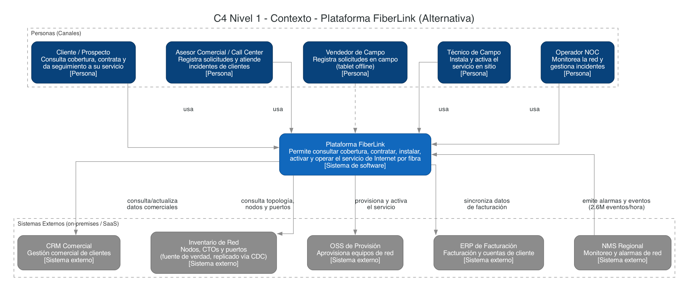
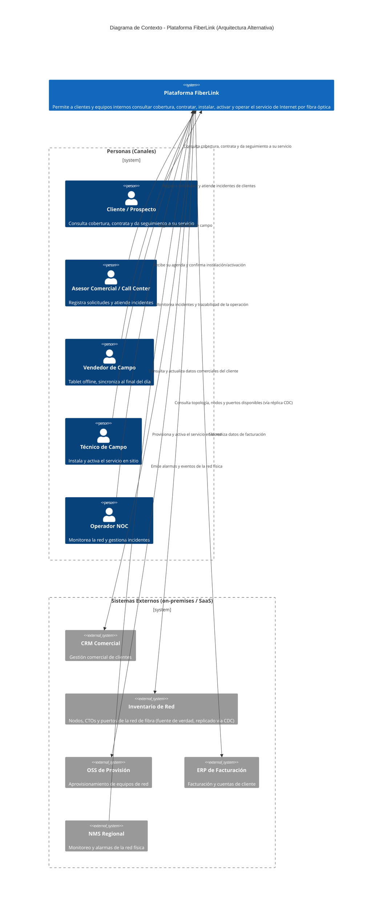

# Diagrama C4 - Nivel 1: Contexto del Sistema (Arquitectura Alternativa)

> Deriva de [`diagrama_arquitectura_alternativa.md`](../diagrama_arquitectura_alternativa.md) /
> [`diagrama_arquitectura_alternativa.py`](../diagrama_arquitectura_alternativa.py). Al igual que
> en la arquitectura vigente, un diagrama de contexto es el nivel más alto de abstracción de un
> sistema y solo debe mostrar cómo el sistema en foco interactúa con actores y sistemas externos,
> sin exponer su implementación interna — por eso la **Plataforma FiberLink** vuelve a aparecer
> aquí como una única caja definida por su propósito de negocio.

## Por qué este diagrama es idéntico al de la arquitectura vigente

Los tres ejes que distinguen a la arquitectura alternativa — **Confluent Cloud/Kafka como backbone
único**, **cómputo serverless (Functions)** y **réplica del inventario vía CDC** — y el cuarto eje
de consolidación (**Portal del Cliente en Azure, sin AWS**) son todos **detalles de implementación
interna**: qué nube aloja cada parte, cómo se integra y cómo se despliega. El diagrama de contexto
C4, por definición, no expone esa capa — solo responde "¿con quién interactúa el sistema y para
qué?". Los actores (canales) y los sistemas externos (CRM, Inventario de Red, OSS, ERP, NMS) son
los mismos en ambas arquitecturas: la alternativa no cambia el alcance funcional ni con quién se
integra la plataforma, solo **cómo** lo hace. Por eso este documento reutiliza el mismo diagrama
que [`../../c4/c4_contexto.md`](../../c4/c4_contexto.md), apuntando sus referencias a la
arquitectura alternativa.

Este diagrama está disponible en dos formatos equivalentes:

- **Mermaid** (embebido más abajo, renderizable en GitHub/IDE).
- **Diagrams (Python)** con la paleta de color estándar del modelo C4: script
  [`diagrama_c4_contexto.py`](diagrama_c4_contexto.py) → imagen
  [`diagrama_c4_contexto.png`](diagrama_c4_contexto.png).
  Regenerar con: `pip install diagrams` (+ Graphviz) y `python3 diagrama_c4_contexto.py`.

## Versión Mermaid

## Notas

- Deliberadamente **no aparecen** en este diagrama: nombres de nube (Azure/GCP), Confluent
  Cloud/Kafka, Azure Functions/Cloud Functions, ni el pipeline de CDC — eso es detalle de
  implementación y corresponde al [diagrama de contenedores](c4_contenedores.md) de esta misma
  alternativa. El único texto añadido respecto al contexto vigente es la aclaración "(fuente de
  verdad, replicado vía CDC)" junto a Inventario de Red, para anticipar —sin detallar— que esta
  alternativa cambia **cómo** se accede a ese sistema externo.
- Los **sistemas externos** son idénticos a los de
  [`../../c4/c4_contexto.md`](../../c4/c4_contexto.md): CRM Comercial, Inventario de Red, OSS de
  Provisión, ERP de Facturación y NMS Regional.
- Se excluyen deliberadamente de este diagrama **GIS**, **Field Service** y el **Proveedor de
  Identidad**, igual que en la arquitectura vigente: siguen existiendo como sistemas
  externos/SaaS en `diagrama_arquitectura_alternativa.md` y en el
  [diagrama de contenedores](c4_contenedores.md), pero no se representan en este nivel.
