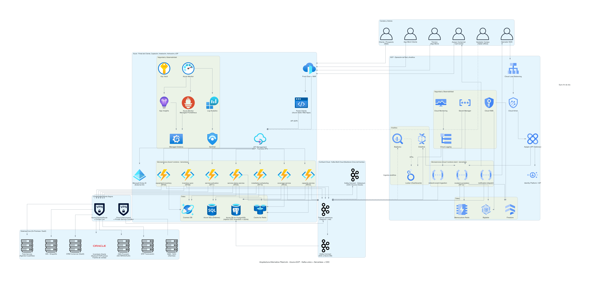

# Diagrama de Arquitectura Alternativa - FiberLink Andina Telecom

> Arquitectura alternativa evaluada para contraste frente a la arquitectura vigente
> ([`diagrama_arquitectura.md`](../diagrama_arquitectura.md)). **No sustituye** la
> arquitectura vigente salvo que se decida adoptarla explícitamente; este documento
> existe para comparar decisiones de diseño.

## Resumen ejecutivo

Esta alternativa combina cuatro ejes de diseño que se refuerzan entre sí:

1. **Backbone de integración único cloud-agnostic** — se reemplaza el puente
   Azure Service Bus/Event Hubs ↔ GCP Pub/Sub por un único bus de eventos
   multinube: **Confluent Cloud (Kafka)**, consumido y publicado directamente
   por los microservicios de Azure y GCP.
2. **Cómputo serverless-first** — los 8 microservicios pasan de contenedores
   administrados (Container Apps / Cloud Run) a **funciones** (Azure Functions
   / Cloud Functions Gen2), activadas por HTTP (rutas síncronas) o por tópicos
   Kafka (rutas asíncronas).
3. **Inventario de red replicado vía CDC** — en lugar de que `coverage-service`
   y `capacity-service` consulten Oracle on-premises en vivo por cada request,
   un pipeline de **Change Data Capture (CDC)** replica continuamente los
   cambios de Oracle hacia una base administrada en Azure, que estos dos
   microservicios consultan localmente.
4. **Portal del Cliente consolidado en Azure (se elimina AWS)** — el Portal
   del Cliente deja de alojarse en AWS (Route 53 + CloudFront/WAF/Shield +
   Amplify/S3) y pasa a **Azure** usando sus equivalentes nativos: **Azure
   Static Web Apps** para el hosting de la SPA, detrás del mismo **Front Door
   + WAF** que ya sirve al resto de los canales (app móvil, asesor, vendedor,
   técnico). Esta arquitectura queda entonces en **2 nubes** (Azure + GCP) en
   vez de 3.

**Por qué se combinan bien:** el backbone Kafka (eje 1) es el transporte
natural del pipeline de CDC (eje 3) — un conector Debezium/Kafka Connect lee
el log de cambios de Oracle y publica en un tópico Kafka; un conector *sink*
materializa esos cambios en Azure. Y las funciones serverless (eje 2) son
naturalmente *event-driven*, por lo que se activan directamente por los mismos
tópicos Kafka sin necesitar un runtime de contenedor siempre activo.

**Qué NO cambia:** el alcance funcional. Siguen siendo los mismos 8
microservicios y el mismo mapeo RF→servicio; GCP sigue concentrando Operación
de red y Analítica. Lo que sí cambia frente a la arquitectura vigente es que
**Azure pasa a concentrar también la presentación** (Portal del Cliente),
además de Captación/Instalación/Activación + EIP — ver eje 4 arriba.

**Principio de comunicación asíncrona por defecto:** con el backbone Kafka ya
disponible, toda comunicación **servicio a servicio** que no requiera una
respuesta síncrona inmediata se enruta a través de Confluent Cloud en lugar de
una llamada directa. El caso concreto en este diagrama es
`incident-correlation-service → notification-dispatch`: hoy es una invocación
directa; en la alternativa, `incident-correlation-service` publica el evento
de notificación en un tópico Kafka y `notification-dispatch` lo consume de
forma asíncrona. Las llamadas que sí exigen respuesta inmediata al canal que
espera (p. ej. APIM/Apigee → microservicio por una consulta de un cliente)
siguen siendo síncronas.

## Qué cambia respecto a la arquitectura vigente

| Aspecto | Arquitectura vigente | Alternativa combinada |
|---|---|---|
| Cómputo microservicios Azure (7) | Container Apps | **Azure Functions** (trigger HTTP + trigger Kafka) |
| Cómputo `incident-correlation-service` (GCP) | Cloud Run | **Cloud Functions Gen2** (trigger Eventarc/Kafka) — ver riesgo de volumen en sección [Riesgos](#riesgos--trade-offs) |
| Backbone de eventos de negocio y de red | Service Bus/Event Grid → Event Hubs ↔ Pub/Sub (puente) | **Confluent Cloud (Kafka) multi-cloud**, bus canónico único |
| Inventario de red (nodos/CTO/puertos) | Oracle on-premises, consulta en vivo vía conectividad híbrida en cada request de `coverage-service`/`capacity-service` | Oracle sigue siendo la fuente de verdad transaccional; se replica vía **CDC (Debezium/Kafka Connect) → Kafka → sink a Azure DB for PostgreSQL**; `coverage-service`/`capacity-service` leen la réplica local |
| Nube del Portal del Cliente | **AWS** (Route 53 + CloudFront/WAF/Shield + Amplify/S3) | **Azure** (Front Door + WAF + Azure Static Web Apps) — se elimina AWS de la arquitectura |
| Mapeo RF → Microservicio → Nube | — | Sin cambios (excepto el Portal, que pasa de AWS a Azure) |

## Mapeo Requerimiento → Microservicio → Nube → Cómputo (actualizado)

| RF | Microservicio | Nube | Cómputo (alternativa) |
|----|---------------|------|------------------------|
| RF03 Consultar cobertura | `coverage-service` | Azure | Azure Functions (lee réplica CDC) |
| RF04 Validar capacidad | `capacity-service` | Azure | Azure Functions (lee réplica CDC) |
| RF05 Consultar estado | `service-status-service` | Azure | Azure Functions |
| RF06 Sincronizar inventario de puertos | `inventory-sync-service` | Azure | Azure Functions |
| RF09 Validar inventario de equipos | `equipment-inventory-service` | Azure | Azure Functions |
| RF10 Reprogramar instalación | `installation-scheduling-service` | Azure | Azure Functions |
| RF11 Activar servicio | `service-activation-service` | Azure | Azure Functions |
| RF12 Correlacionar incidentes | `incident-correlation-service` | GCP | Cloud Functions Gen2 * |
| — Portal del Cliente (front) | `customer-portal` (SPA) | **Azure** (antes AWS) | Azure Static Web Apps + Front Door/WAF |

`*` Servicio de mayor volumen sostenido (2.6M eventos/hora); ver mitigación sugerida en [Riesgos](#riesgos--trade-offs).

## Diagrama de Arquitectura

Este diagrama está disponible en dos formatos equivalentes:

- **Mermaid** (embebido más abajo, renderizable en GitHub/IDE).
- **Diagrams (Python)** con íconos oficiales de cada nube: script
  [`diagrama_arquitectura_alternativa.py`](diagrama_arquitectura_alternativa.py) → imagen
  [`diagrama_arquitectura_alternativa.png`](diagrama_arquitectura_alternativa.png).
  Regenerar con: `pip install diagrams` (+ Graphviz) y
  `python3 diagrama_arquitectura_alternativa.py`.

### Versión Mermaid

```mermaid
flowchart TB
    %% ================= CANALES =================
    subgraph CH["Canales y Actores"]
        direction LR
        U1["Cliente / Prospecto (Web)"]:::channel
        U2["App Movil Cliente"]:::channel
        U3["Asesor Comercial / Call Center"]:::channel
        U4["Vendedor Campo (Tablet offline)"]:::channel
        U5["Tecnico (App Movil)"]:::channel
        U6["Operador NOC"]:::channel
    end

    %% ================= AZURE =================
    subgraph AZ["Azure  -  Portal del Cliente, Captacion, Instalacion, Activacion y EIP"]
        direction TB
        zFD["Front Door + WAF"]:::azure
        zPortal["Portal Cliente (Azure Static Web Apps)"]:::azure
        zEID["Microsoft Entra ID (External ID)"]:::azure
        zAPIM["API Management  (EIP - Fachada API)"]:::azure
        subgraph AZ_MS["Microservicios (Azure Functions - Serverless)"]
            direction LR
            msCov["coverage-service (RF03) - Function"]:::azure
            msCap["capacity-service (RF04) - Function"]:::azure
            msSt["service-status-service (RF05) - Function"]:::azure
            msSync["inventory-sync (RF06) - Function"]:::azure
            msEq["equipment-inventory (RF09) - Function"]:::azure
            msSch["installation-scheduling (RF10) - Function"]:::azure
            msAct["service-activation (RF11) - Function"]:::azure
        end
        zPG["Azure DB for PostgreSQL (replica CDC inventario + cache)"]:::azure
        zSQL["Azure SQL (Ordenes)"]:::azure
        zCos["Cosmos DB"]:::azure
        zRedis["Cache for Redis"]:::azure
        zKV["Key Vault"]:::azure
        zObs["Azure Monitor + App Insights + Sentinel"]:::azure
    end

    %% ================= BACKBONE DE EVENTOS MULTI-CLOUD =================
    subgraph KAFKA["Confluent Cloud - Kafka Multi-Cloud (Backbone Unico de Eventos)"]
        direction TB
        kConf["Topicos canonicos (negocio + red)"]:::kafka
        kCDCsrc["Kafka Connect - Debezium (CDC Source Oracle)"]:::kafka
        kCDCsink["Kafka Connect (Sink a Azure DB)"]:::kafka
    end

    %% ================= GCP =================
    subgraph GCP["GCP  -  Operacion de Red y Analitica"]
        direction TB
        gLB["Cloud LB + Cloud Armor"]:::gcp
        gAGW["Apigee / API Gateway"]:::gcp
        gIDP["Identity Platform / IAP"]:::gcp
        subgraph GCP_MS["Microservicios (Cloud Functions Gen2 - Serverless)"]
            direction LR
            msInc["incident-correlation (RF12) - Function *"]:::gcp
            msIngest["network-event-ingestion - Function"]:::gcp
            msNotif["notification-dispatch - Function"]:::gcp
        end
        gDF["Dataflow"]:::gcp
        gBT["Bigtable"]:::gcp
        gFS["Firestore"]:::gcp
        gMem["Memorystore Redis"]:::gcp
        gBQ["BigQuery"]:::gcp
        gLook["Looker (Dashboards)"]:::gcp
        gSec["Secret Manager + Cloud KMS"]:::gcp
        gObs["Cloud Monitoring / Logging / Trace + Grafana"]:::gcp
    end

    %% ================= CONECTIVIDAD HIBRIDA =================
    subgraph NET["Conectividad Hibrida Segura (SEG-10)"]
        direction LR
        netAZ["Azure ExpressRoute + Private Link"]:::azure
        netGCP["Cloud Interconnect + Private Service Connect"]:::gcp
    end

    %% ================= SISTEMAS CORE =================
    subgraph CORE["Sistemas Core (On-Premises / SaaS)"]
        direction LR
        cCRM["CRM Comercial (SaaS)"]:::onprem
        cOra["Inventario Oracle (Nodos/CTO/Puertos) - Fuente de verdad"]:::onprem
        cGIS["GIS / Shapefile"]:::onprem
        cOSS["OSS Provision (OLT/BRAS/Auth)"]:::onprem
        cERP["ERP Facturacion"]:::onprem
        cFS["Field Service (Agenda Cuadrillas)"]:::onprem
        cNMS["NMS / NOC (Alarmas)"]:::onprem
    end

    %% ---------- Flujos de canal ----------
    U1 --> zFD --> zPortal
    zPortal -- "API (EIP)" --> zAPIM
    U2 --> zFD
    U3 --> zFD
    U4 -. "Sync fin de dia" .-> zAPIM
    U5 --> zFD
    U6 --> gLB

    zFD --> zAPIM
    zAPIM --> zEID
    zAPIM --> msCov & msCap & msSt & msSync & msEq & msSch & msAct
    gLB --> gAGW
    gAGW --> gIDP
    gAGW --> msInc

    %% ---------- Datos por microservicio ----------
    msCov --> zRedis
    msCov --> zPG
    msCap --> zRedis
    msCap --> zPG
    msSt --> zRedis
    msSt --> zCos
    msSch --> zSQL
    msAct --> zSQL
    msEq --> zCos
    msSync --> zCos
    msInc --> gBT
    msInc --> gFS
    msInc --> gMem

    %% ---------- Backbone de eventos unico (Kafka multi-cloud) ----------
    msCov & msCap & msSt & msSync & msEq & msSch & msAct <--> kConf
    msIngest <--> kConf
    msInc <--> kConf
    msNotif <--> kConf
    kConf --> gDF --> msInc
    kConf -. "Ingesta analitica" .-> gBQ
    gBQ -. "KPIs" .-> gLook
    msNotif --> U3
    msNotif --> U6

    %% ---------- Pipeline CDC de inventario (sobre el backbone Kafka) ----------
    netAZ --> kCDCsrc
    kCDCsrc --> kConf
    kConf --> kCDCsink
    kCDCsink --> zPG

    %% ---------- Acceso a core via conectividad hibrida (mediado por EIP) ----------
    msSt --> netAZ
    msSync --> netAZ
    msAct --> netAZ
    msSch --> netAZ
    msEq --> netAZ
    netAZ --> cCRM
    netAZ --> cOra
    netAZ --> cGIS
    netAZ --> cOSS
    netAZ --> cERP
    netAZ --> cFS

    %% ---------- Flujo de operacion de red ----------
    cNMS --> netGCP --> kConf

    %% ================= ESTILOS =================
    classDef azure fill:#0078D4,stroke:#ffffff,color:#ffffff;
    classDef gcp fill:#1A73E8,stroke:#ffffff,color:#ffffff;
    classDef onprem fill:#5A6470,stroke:#ffffff,color:#ffffff;
    classDef channel fill:#EAEDED,stroke:#232F3E,color:#232F3E;
    classDef kafka fill:#231F20,stroke:#ffffff,color:#ffffff;
```

## Flujo explicado

- **Consulta de cobertura (RF03), hoy vs. alternativa:** hoy, `coverage-service`
  consulta el Inventario Oracle en vivo a través de conectividad híbrida
  (ExpressRoute/Private Link) en cada una de las 150,000 consultas diarias. En
  la alternativa, `coverage-service` (ahora una Azure Function) lee
  exclusivamente de la réplica local en `zPG`, alimentada de forma continua
  por el pipeline CDC — la conectividad híbrida hacia Oracle solo la usa el
  conector Debezium, no el tráfico de consulta de clientes.
- **Cambio de estado en Oracle → réplica:** Oracle emite un cambio (p. ej. un
  puerto pasa a "ocupado") → Debezium lo captura del log de cambios →
  publica un evento en un tópico Kafka de Confluent Cloud → un conector *sink*
  materializa el cambio en `zPG`. El lag de esta réplica pasa a ser la métrica
  de frescura de datos de cobertura/capacidad (antes el problema eran desfases
  de hasta 6 meses; ahora es un lag de replicación medible en segundos/minutos).
- **Evento de instalación completada (RF11), hoy vs. alternativa:** hoy,
  `service-activation-service` publica en Azure Service Bus, que reenvía a
  Event Hubs, que se puentea hacia GCP Pub/Sub. En la alternativa,
  `service-activation-service` publica directamente en un tópico de Confluent
  Cloud, consumido tanto por servicios en Azure como en GCP sin bridging
  adicional entre dos tecnologías de bus distintas.
- **Notificación de incidente (RF12) → `notification-dispatch`, hoy vs.
  alternativa:** hoy `incident-correlation-service` invoca directamente a
  `notification-dispatch` (llamada síncrona servicio-a-servicio). En la
  alternativa, `incident-correlation-service` publica un evento de
  notificación en un tópico Kafka y `notification-dispatch` lo consume de
  forma asíncrona — se desacoplan ambos servicios (uno puede escalar,
  reintentar o degradarse temporalmente sin bloquear al otro) y el propio
  tópico queda como evidencia de la notificación generada. La entrega final
  del mensaje al Asesor Comercial/Call Center y al Operador NOC sí sigue
  siendo una acción directa de `notification-dispatch` hacia el canal
  correspondiente, porque ahí no hay otro servicio esperando una respuesta.
- **Acceso al Portal del Cliente, hoy vs. alternativa:** hoy el navegador
  resuelve Route 53 (AWS) y recibe la SPA desde CloudFront/Amplify, que luego
  llama a Azure APIM. En la alternativa, el navegador llega directo a Azure
  Front Door, que sirve la SPA desde Azure Static Web Apps; la SPA sigue
  llamando a APIM (EIP) para los datos, ahora dentro de la misma nube.

## Ventajas

- Ataca la causa raíz del problema de Fase 1 (datos de cobertura desactualizados,
  desfases de hasta 6 meses): las lecturas de `coverage-service`/`capacity-service`
  dejan de depender de la disponibilidad y latencia de la conectividad híbrida
  en el camino síncrono.
- Un solo modelo y tecnología de eventos a gobernar (Kafka/Confluent) en vez
  de dos (Event Hubs + Pub/Sub) con su puente — simplifica esquemas, versionado
  (INT-05) y monitoreo de fallas de publicación (OBS-04).
- Costo variable y escalado a cero en los microservicios de baja/intermitente
  demanda gracias al modelo serverless (ESC-03), en línea con los picos de 4x
  el promedio descritos en la volumetría.
- El pipeline de CDC deja evidencia continua de sincronización (lag, eventos
  procesados), lo que aporta trazabilidad adicional más allá del acceso directo
  actual (refuerza INT-08 y RNOF01).
- Las comunicaciones servicio-a-servicio que no requieren respuesta inmediata
  (p. ej. `incident-correlation-service` → `notification-dispatch`) se
  desacoplan vía el backbone Kafka en lugar de llamadas directas, reduciendo
  el radio de fallo entre microservicios (ESC-06) y evitando que una caída o
  lentitud de `notification-dispatch` afecte la correlación de incidentes.
- Al consolidar el Portal del Cliente en Azure junto con el resto de canales,
  una sola política de WAF/CDN (Front Door) y un solo proveedor de identidad
  (Entra ID) cubren **todos** los canales de cliente, en vez de mantener WAF y
  gestión de certificados/DNS duplicados entre AWS y Azure — simplifica
  SEG-07 y reduce la superficie a asegurar y monitorear.

## Riesgos / trade-offs

- **Cold start en rutas de alto volumen:** `coverage-service` y `capacity-service`
  atienden 150,000 + 80,000 operaciones/día con picos de 4x. Las funciones
  serverless pueden introducir latencia de arranque en frío que afecte ESC-02.
  Mitigación sugerida: usar plan Premium/Elastic Premium de Azure Functions
  con instancias pre-calentadas para estas dos rutas específicas.
- **`incident-correlation-service` en Cloud Functions:** este servicio procesa
  2.6M eventos/hora de forma sostenida, un perfil de carga constante para el
  que Cloud Run (contenedores siempre activos, escalado por concurrencia) es
  técnicamente más adecuado que un modelo de invocación por evento. Se señala
  esta tensión explícitamente: si el volumen sostenido genera cold starts o
  cuellos de botella de invocación, se recomienda **mantener este servicio en
  Cloud Run** y aplicar serverless solo a los 7 microservicios de Azure.
- **Nuevo componente externo crítico:** Confluent Cloud pasa a ser el bus
  canónico de toda la plataforma; su disponibilidad, cuotas y costo de
  licenciamiento deben gestionarse como un componente de primer nivel (nuevo
  punto a cubrir en SEG-07/SEG-11 y en los dashboards de OBS-07).
- **Riesgo de desincronización del CDC:** si el conector Debezium falla o se
  atrasa, la réplica en `zPG` puede quedar desactualizada sin que el
  microservicio lo perciba. Oracle sigue siendo la fuente de verdad; se debe
  monitorear el lag de replicación como métrica de negocio (OBS-03) y definir
  una alerta explícita (OBS-04) para desviaciones por encima de un umbral.
- **Concentración de riesgo en un solo proveedor:** al eliminar AWS, la
  plataforma pierde la diversificación de proveedor que ya tenía para la capa
  de presentación (si Azure tiene una interrupción regional, ahora también
  afecta al portal) y deja de aprovechar la madurez específica de AWS
  CloudFront/Shield en mitigación de DDoS a nivel de borde. Esto es un
  trade-off consciente a favor de simplicidad operativa (un proveedor menos
  que gobernar, asegurar y facturar).

## Impacto en lineamientos

- **Favorece:** ESC-03 (escalado horizontal vía serverless), ESC-04/ESC-05
  (caché y asincronía — el patrón CDC es, en esencia, una forma de cache
  asíncrono del inventario), INT-02 (desacoplo por eventos con un solo bus),
  INT-06 (idempotencia en consumidores Kafka, requerida por el modelo de
  al-menos-una-entrega de Kafka), OBS-03 (nueva métrica de lag de replicación).
- **En tensión (decisión explícita, no violación no informada):** los
  lineamientos de stack tecnológico recomiendan "Container Apps/Cloud Run para
  la mayoría de microservicios" y reservan Functions/Cloud Functions para
  cargas intermitentes o impredecibles. Esta alternativa aplica serverless de
  forma más amplia, incluyendo rutas de alto volumen (`coverage-service`,
  `capacity-service`) y un servicio de volumen sostenido
  (`incident-correlation-service`), lo cual solo se justifica con las
  mitigaciones de la sección [Riesgos](#riesgos--trade-offs) (plan Premium,
  o mantener `incident-correlation-service` en Cloud Run).

## Nota aclaratoria

Esta es una alternativa evaluada para contraste y toma de decisión. La
arquitectura vigente sigue siendo la descrita en
[`diagrama_arquitectura.md`](../diagrama_arquitectura.md) salvo que se decida
adoptar, total o parcialmente, esta combinación.

## Leyenda

- 🟦 **Azure** &nbsp; 🔵 **GCP** &nbsp; ⬛ **Core On-Premises / SaaS**
  &nbsp; ⬜ **Canales** &nbsp; ⬛ **Kafka / Confluent Cloud**
- `<-->` Publicación/consumo bidireccional en tópicos Kafka · `-.->` Flujo asíncrono / analítico · `-->` Flujo síncrono o de transporte de datos
