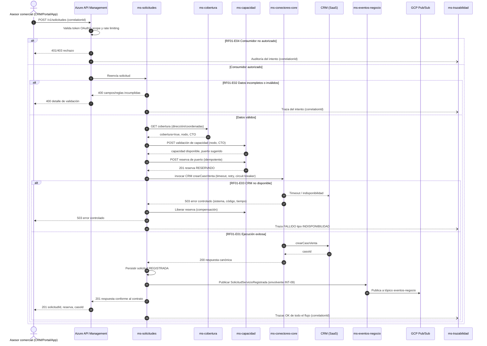

# Diagrama de Secuencia — RF01 Registrar solicitud de servicio

Cubre: RF01-E01 (exitoso), RF01-E02 (solicitud inválida), RF01-E03 (sistema destino no disponible), RF01-E04 (no autorizado).

```mermaid
sequenceDiagram
    autonumber
    actor Asesor as Asesor comercial (CRM/Portal/App)
    participant APIM as Azure API Management
    participant SOL as ms-solicitudes
    participant COB as ms-cobertura
    participant CAP as ms-capacidad
    participant CON as ms-conectores-core
    participant CRM as CRM (SaaS)
    participant EVT as ms-eventos-negocio
    participant PS as GCP Pub/Sub
    participant TRZ as ms-trazabilidad

    Asesor->>APIM: POST /v1/solicitudes (correlationId)
    APIM->>APIM: Valida token OAuth2, scope y rate limiting

    alt RF01-E04 Consumidor no autorizado
        APIM-->>Asesor: 401/403 rechazo
        APIM--)TRZ: Auditoría del intento (correlationId)
    else Consumidor autorizado
        APIM->>SOL: Reenvía solicitud
        alt RF01-E02 Datos incompletos o inválidos
            SOL-->>APIM: 400 campos/reglas incumplidas
            APIM-->>Asesor: 400 detalle de validación
            SOL--)TRZ: Traza del intento (correlationId)
        else Datos válidos
            SOL->>COB: GET cobertura (dirección/coordenadas)
            COB-->>SOL: cobertura=true, nodo, CTO
            SOL->>CAP: POST validación de capacidad (nodo, CTO)
            CAP-->>SOL: capacidad disponible, puerto sugerido
            SOL->>CAP: POST reserva de puerto (idempotente)
            CAP-->>SOL: 201 reserva RESERVADO
            SOL->>CON: invocar CRM crearCasoVenta (timeout, retry, circuit breaker)
            alt RF01-E03 CRM no disponible
                CON--xCRM: Timeout / indisponibilidad
                CON-->>SOL: 503 error controlado (sistema, código, tiempo)
                SOL->>CAP: Liberar reserva (compensación)
                SOL-->>Asesor: 503 error controlado
                SOL--)TRZ: Traza FALLIDO tipo INDISPONIBILIDAD
            else RF01-E01 Ejecución exitosa
                CON->>CRM: crearCasoVenta
                CRM-->>CON: casoId
                CON-->>SOL: 200 respuesta canónica
                SOL->>SOL: Persistir solicitud REGISTRADA
                SOL->>EVT: Publicar SolicitudServicioRegistrada (envolvente INT-09)
                EVT->>PS: Publica a tópico eventos-negocio
                SOL-->>APIM: 201 respuesta conforme al contrato
                APIM-->>Asesor: 201 solicitudId, reserva, casoId
                SOL--)TRZ: Trazas OK de todo el flujo (correlationId)
            end
        end
    end
```
