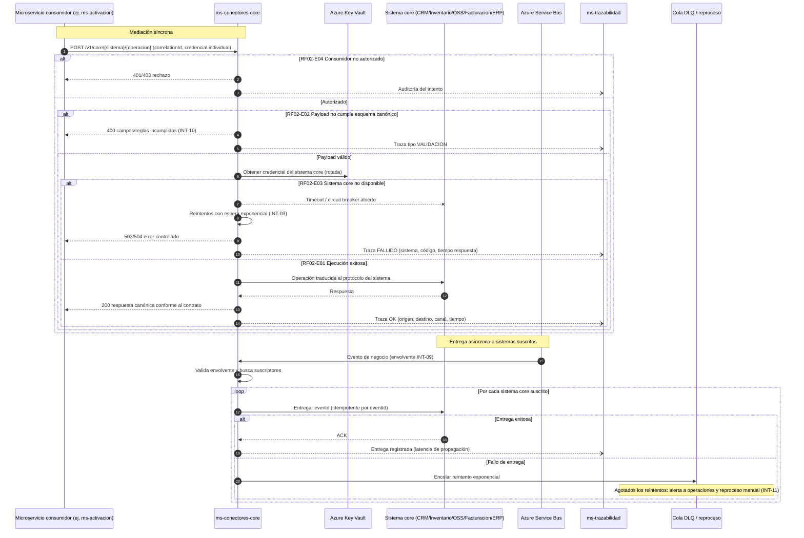

# Diagrama de Secuencia — RF02 Integrar sistemas críticos

Cubre: RF02-E01 (exitoso), RF02-E02 (solicitud inválida), RF02-E03 (sistema destino no disponible), RF02-E04 (no autorizado). Muestra la mediación síncrona y la entrega asíncrona de eventos a sistemas suscritos (sin integraciones punto a punto — INT-07).

