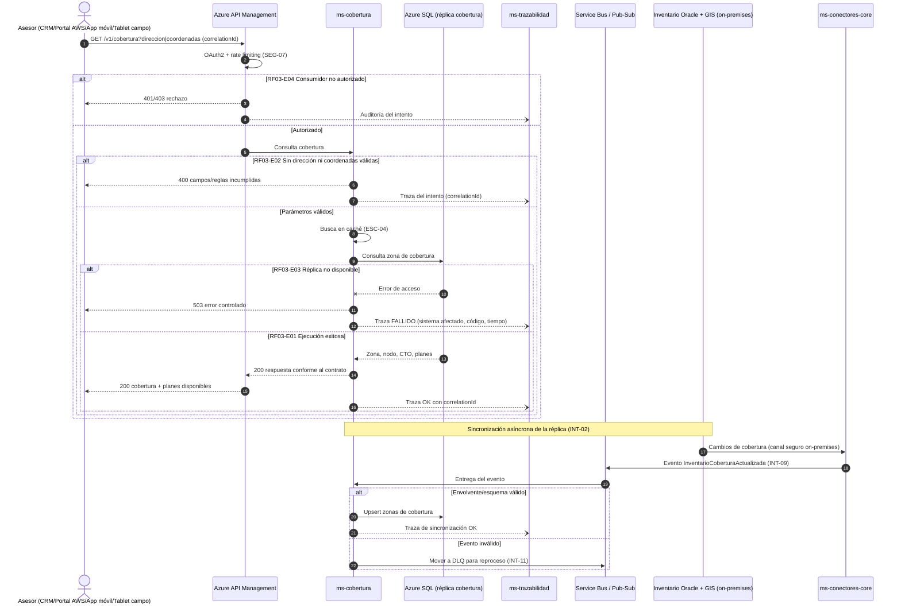

# Diagrama de Secuencia — RF03 Consultar cobertura

Cubre: RF03-E01 (exitoso), RF03-E02 (solicitud inválida), RF03-E03 (sistema destino no disponible), RF03-E04 (no autorizado). Incluye la sincronización asíncrona de la réplica desde Inventario/GIS.

