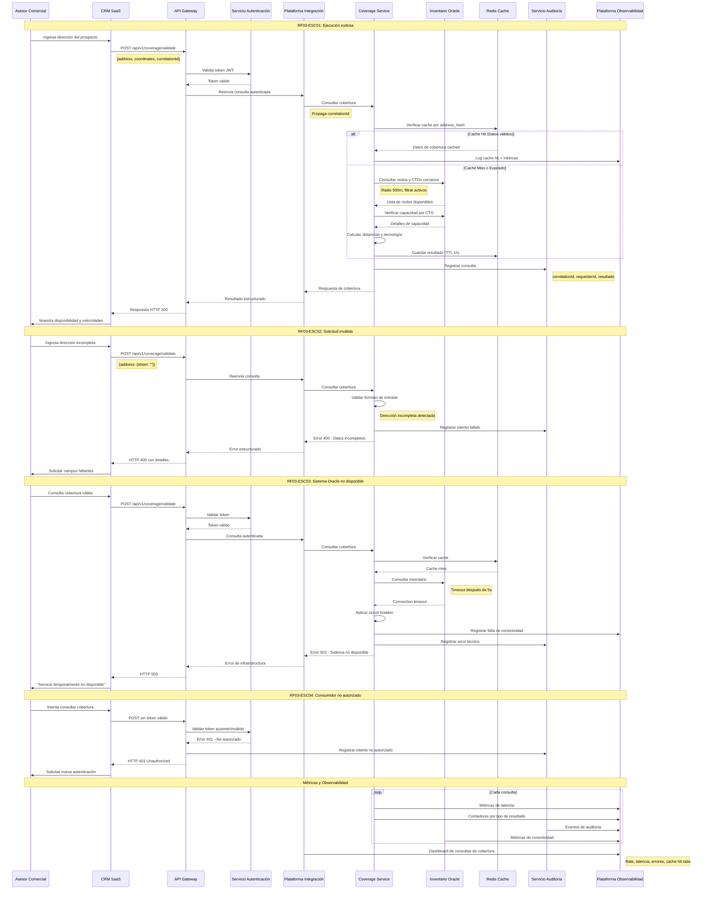

# Diagrama de Secuencia - RF03: Consultar Cobertura

## Descripción
Flujo completo de consulta de cobertura de fibra óptica por dirección o coordenadas a través de la Plataforma de Integración Empresarial.

## Diagrama de Secuencia

## Escenarios Cubiertos

### ESC01: Ejecución Exitosa
- **Flujo Principal**: Consulta válida con respuesta exitosa desde cache o Oracle
- **Validaciones**: Autenticación, formato de dirección, coordenadas válidas
- **Optimización**: Cache Redis para reducir carga en Oracle

### ESC02: Solicitud Inválida
- **Validaciones**: Campos obligatorios, formato de coordenadas
- **Respuesta**: Error estructurado con campos faltantes
- **Auditoría**: Registro de intentos fallidos para análisis

### ESC03: Sistema Oracle No Disponible
- **Resilencia**: Circuit breaker para evitar cascada de fallos
- **Fallback**: Respuesta controlada sin comprometer otros sistemas
- **Monitoreo**: Alertas automáticas por indisponibilidad

### ESC04: Consumidor No Autorizado
- **Seguridad**: Validación de tokens JWT en API Gateway
- **Auditoría**: Registro de intentos no autorizados
- **Respuesta**: Error estándar sin revelar información interna

## Lineamientos Aplicados

- **ARQ-03**: Responsabilidad clara del Coverage Service
- **INT-01**: API versionada con contratos documentados
- **SEG-04**: Autenticación centralizada
- **ESC-04**: Cache para optimizar performance
- **OBS-02**: Trazabilidad end-to-end con correlationId
- **INT-18**: Degradación elegante ante fallos de Oracle