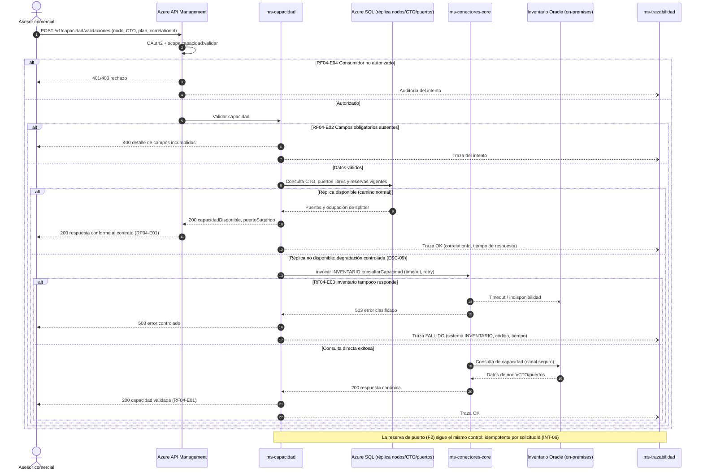

# Diagrama de Secuencia — RF04 Validar capacidad técnica

Cubre: RF04-E01 (exitoso), RF04-E02 (solicitud inválida), RF04-E03 (sistema destino no disponible con degradación), RF04-E04 (no autorizado).

