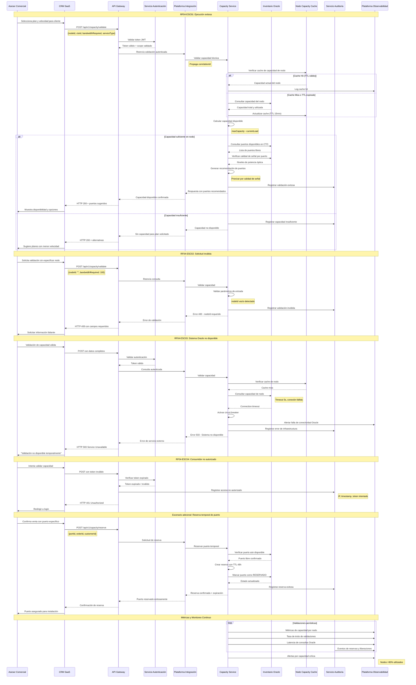

# Diagrama de Secuencia - RF04: Validar Capacidad Técnica

## Descripción
Flujo completo de validación de capacidad técnica en nodo, CTO y puertos disponibles para evitar ventas de servicios que no pueden ser instalados.

## Diagrama de Secuencia

## Escenarios Cubiertos

### ESC01: Ejecución Exitosa
- **Flujo Principal**: Validación completa con cache y consulta a Oracle
- **Optimización**: Cache de capacidad de nodo para reducir latencia
- **Recomendación**: Algoritmo de selección de mejores puertos

### ESC02: Solicitud Inválida
- **Validaciones**: nodeId, ctoId, bandwidth obligatorios
- **Respuesta**: Error estructurado con campos específicos faltantes
- **Auditoría**: Registro para análisis de calidad de datos

### ESC03: Sistema Oracle No Disponible
- **Resilencia**: Circuit breaker evita saturar Oracle
- **Monitoreo**: Alertas automáticas por indisponibilidad
- **Fallback**: Respuesta controlada sin afectar otros flujos

### ESC04: Consumidor No Autorizado
- **Seguridad**: Validación estricta de tokens y scopes
- **Auditoría**: Trazabilidad de intentos no autorizados
- **Protección**: Sin revelar información de infraestructura

### ESC05: Reserva Temporal de Puerto
- **Funcionalidad**: Reserva con TTL automático
- **Consistencia**: Verificación antes de reservar
- **Liberación**: Job automático tras 48 horas

## Lineamientos Aplicados

- **ARQ-03**: Responsabilidad especializada en validación de capacidad
- **ESC-03**: Escalamiento horizontal con cache distribuido
- **ESC-06**: Prevención de cuellos de botella en Oracle
- **INT-06**: Operaciones idempotentes en reservas
- **SEG-07**: Auditoría completa de validaciones y reservas
- **OBS-03**: Métricas técnicas y de negocio integradas