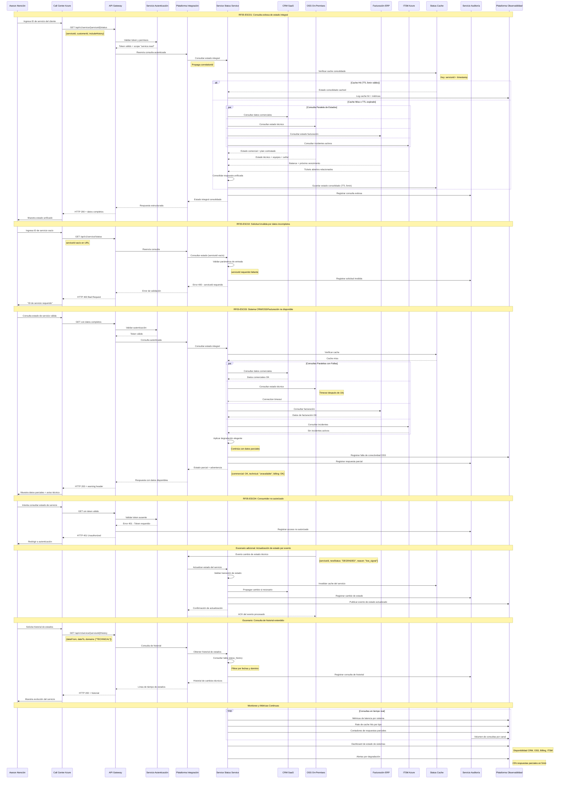

# Diagrama de Secuencia - RF05: Consultar Estado de Servicio

## Descripción
Flujo completo de consulta del estado comercial, técnico y de facturación del servicio para brindar respuesta consistente al cliente.

## Diagrama de Secuencia

## Escenarios Cubiertos

### ESC01: Consulta Exitosa de Estado Integral
- **Consolidación**: Datos de CRM, OSS, Facturación e ITSM unificados
- **Optimización**: Cache con TTL corto (5min) para datos críticos
- **Paralelización**: Consultas simultáneas para reducir latencia

### ESC02: Solicitud Inválida por Datos Incompletos
- **Validación**: serviceId obligatorio y formato válido
- **Respuesta**: Error estructurado con campo específico faltante
- **Auditoría**: Registro para mejora de interfaz de usuario

### ESC03: Sistema Core No Disponible
- **Resilencia**: Degradación elegante con datos parciales
- **Continuidad**: Servicio funcional con información disponible
- **Transparencia**: Indicadores claros de datos faltantes

### ESC04: Consumidor No Autorizado
- **Seguridad**: Validación de token y scope específico
- **Protección**: Sin revelar información del servicio
- **Auditoría**: Trazabilidad de accesos no autorizados

### ESC05: Actualización por Evento
- **Reactividad**: Invalidación de cache ante cambios
- **Propagación**: Sincronización entre sistemas
- **Trazabilidad**: Auditoría de cambios de estado

### ESC06: Consulta de Historial
- **Funcionalidad**: Acceso a evolución temporal del servicio
- **Filtrado**: Por fechas y dominios específicos
- **Performance**: Índices optimizados para consultas históricas

## Lineamientos Aplicados

- **ARQ-02**: Desacoplamiento entre CRM, OSS y Facturación
- **ARQ-03**: Responsabilidad clara como facade de consulta
- **ESC-04**: Cache estratégico para datos frecuentes
- **INT-18**: Degradación elegante ante fallos parciales
- **OBS-02**: Trazabilidad completa con correlationId
- **SEG-05**: Autorización granular por dominio de datos