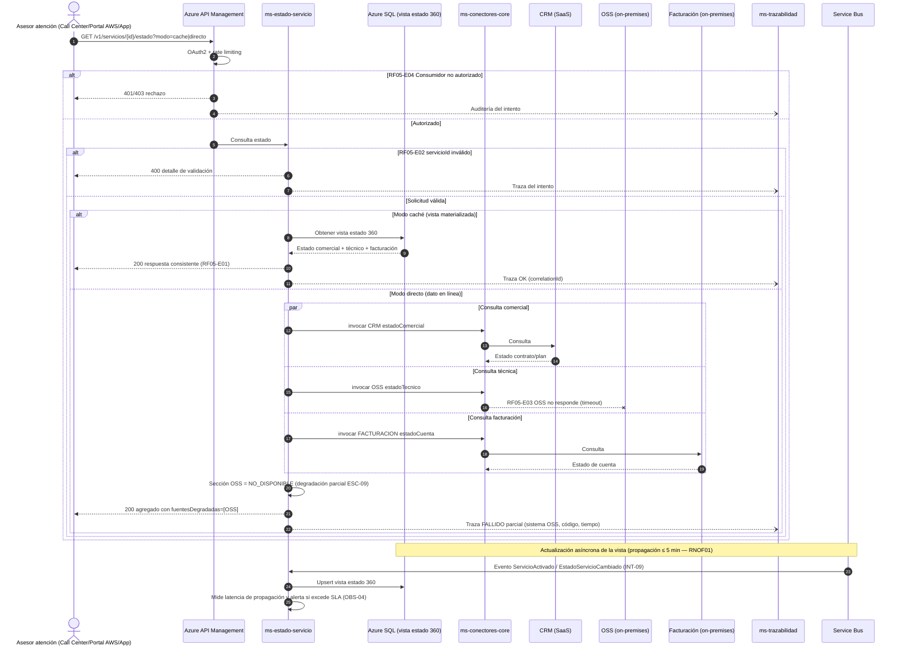

# Diagrama de Secuencia — RF05 Consultar estado de servicio

Cubre: RF05-E01 (exitoso), RF05-E02 (solicitud inválida), RF05-E03 (sistema no disponible con degradación parcial), RF05-E04 (no autorizado).

