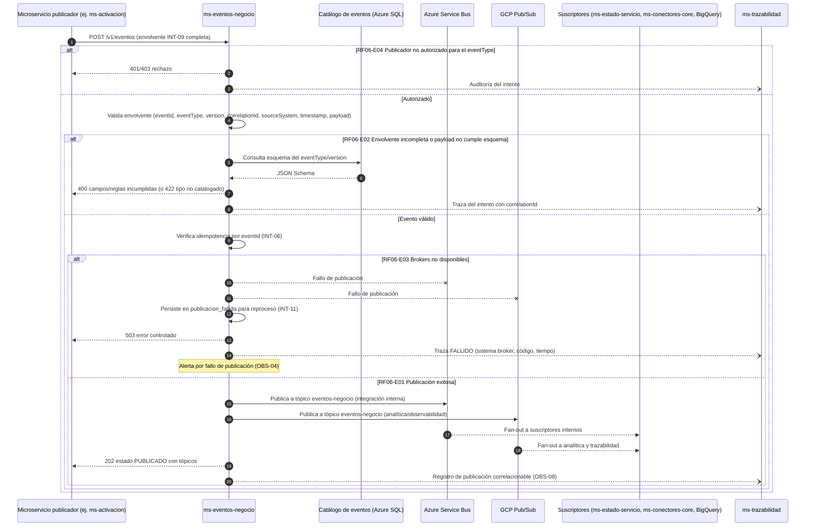

# Diagrama de Secuencia — RF06 Publicar eventos de negocio

Cubre: RF06-E01 (exitoso), RF06-E02 (solicitud inválida), RF06-E03 (broker no disponible), RF06-E04 (no autorizado).

```mermaid
sequenceDiagram
    autonumber
    participant MS as Microservicio publicador (ej. ms-activacion)
    participant EVT as ms-eventos-negocio
    participant CAT as Catálogo de eventos (Azure SQL)
    participant SB as Azure Service Bus
    participant PS as GCP Pub/Sub
    participant SUB as Suscriptores (ms-estado-servicio, ms-conectores-core, BigQuery)
    participant TRZ as ms-trazabilidad

    MS->>EVT: POST /v1/eventos (envolvente INT-09 completa)
    alt RF06-E04 Publicador no autorizado para el eventType
        EVT-->>MS: 401/403 rechazo
        EVT--)TRZ: Auditoría del intento
    else Autorizado
        EVT->>EVT: Valida envolvente (eventId, eventType, version, correlationId, sourceSystem, timestamp, payload)
        alt RF06-E02 Envolvente incompleta o payload no cumple esquema
            EVT->>CAT: Consulta esquema del eventType/version
            CAT-->>EVT: JSON Schema
            EVT-->>MS: 400 campos/reglas incumplidas (o 422 tipo no catalogado)
            EVT--)TRZ: Traza del intento con correlationId
        else Evento válido
            EVT->>EVT: Verifica idempotencia por eventId (INT-06)
            alt RF06-E03 Brokers no disponibles
                EVT--xSB: Fallo de publicación
                EVT--xPS: Fallo de publicación
                EVT->>EVT: Persiste en publicacion_fallida para reproceso (INT-11)
                EVT-->>MS: 503 error controlado
                EVT--)TRZ: Traza FALLIDO (sistema broker, código, tiempo)
                Note over EVT: Alerta por fallo de publicación (OBS-04)
            else RF06-E01 Publicación exitosa
                EVT->>SB: Publica a tópico eventos-negocio (integración interna)
                EVT->>PS: Publica a tópico eventos-negocio (analítica/observabilidad)
                SB-->>SUB: Fan-out a suscriptores internos
                PS-->>SUB: Fan-out a analítica y trazabilidad
                EVT-->>MS: 202 estado PUBLICADO con tópicos
                EVT--)TRZ: Registro de publicación correlacionable (OBS-08)
            end
        end
    end
```
