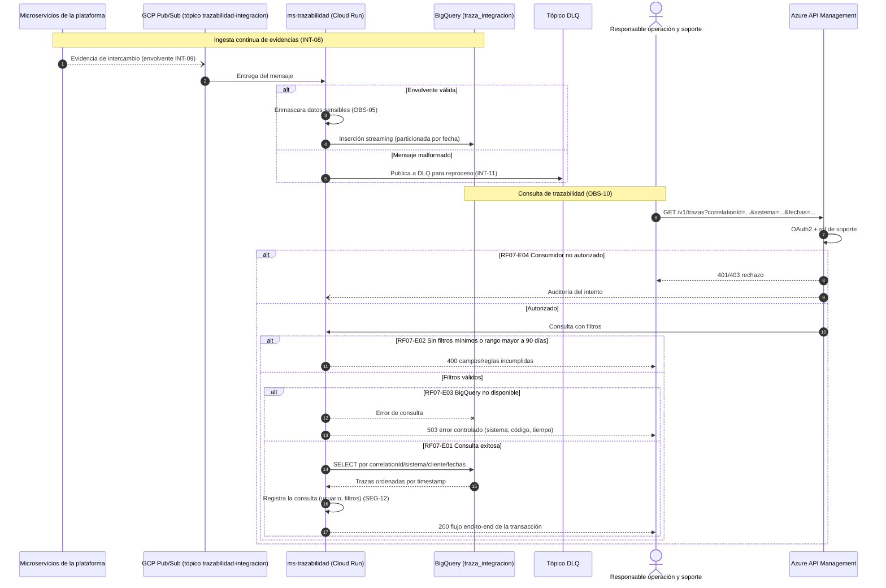

# Diagrama de Secuencia — RF07 Registrar trazabilidad de integración

Cubre: RF07-E01 (exitoso), RF07-E02 (solicitud inválida), RF07-E03 (almacén no disponible), RF07-E04 (no autorizado). Incluye ingesta y consulta.

