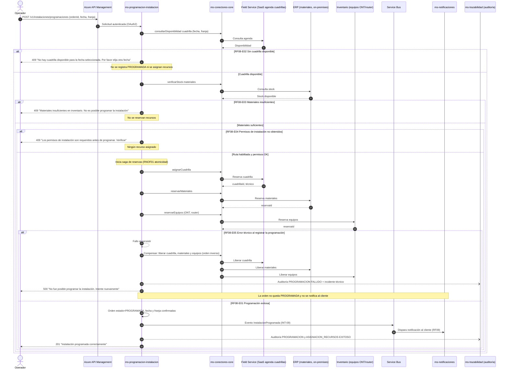

# Diagrama de Secuencia — RF08 Programar instalación del servicio de internet

Cubre: RF08-E01 (programación exitosa), RF08-E02 (cuadrilla no disponible), RF08-E03 (materiales insuficientes), RF08-E04 (permisos no obtenidos), RF08-E05 (error técnico con reversión).

