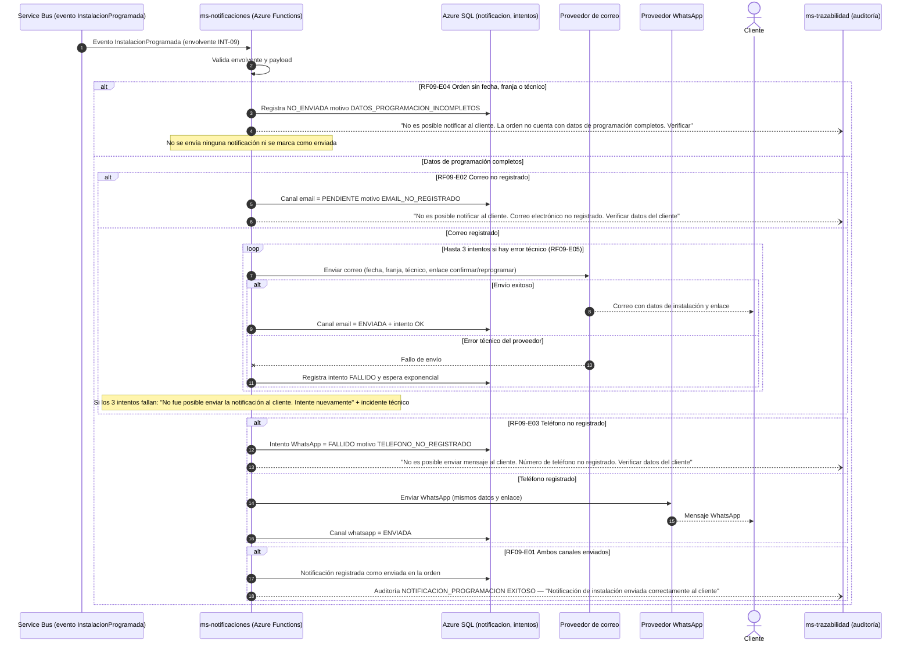

# Diagrama de Secuencia — RF09 Notificar programación de instalación

Cubre: RF09-E01 (notificación exitosa), RF09-E02 (correo no registrado), RF09-E03 (teléfono no registrado), RF09-E04 (datos de programación incompletos), RF09-E05 (error técnico con 3 reintentos).

