# Diagrama de Secuencia - RF09: Validar Inventario de Equipos para Instalación

## Descripción
Flujo completo de validación de inventario de equipos (ONT, router) para evitar visitas fallidas por falta de equipos en almacén.

## Diagrama de Secuencia

```mermaid
sequenceDiagram
    participant Coord as Coordinador Instalación
    participant FieldService as SaaS Field Service
    participant APIGw as API Gateway
    participant Auth as Servicio Autenticación
    participant PIE as Plataforma Integración
    participant EIS as Equipment Inventory Service
    participant ERP as ERP On-Premises
    participant Cache as Equipment Cache
    participant WMS as Warehouse Management
    participant Audit as Servicio Auditoría
    participant Obs as Plataforma Observabilidad

    Note over Coord, Obs: RF09-ESC01: Validación exitosa de disponibilidad de equipos

    Coord->>FieldService: Programa instalación para mañana
    FieldService->>APIGw: POST /api/v1/equipment/validate
    Note right of FieldService: {planType, serviceSpeed, warehouseId, orderId}
    
    APIGw->>Auth: Validar token coordinador
    Auth-->>APIGw: Token válido + permisos warehouse
    
    APIGw->>PIE: Reenvía validación autenticada
    PIE->>EIS: Validar inventario de equipos
    Note right of PIE: Propaga correlationId
    
    EIS->>EIS: Determinar equipos necesarios según plan
    Note right of EIS: Plan 100MB → ONT GPON + Router WiFi6
    
    EIS->>Cache: Verificar cache de inventario
    Note right of Cache: TTL 30min para datos de stock
    
    alt Cache Hit (datos frescos)
        Cache-->>EIS: Stock disponible por modelo
        EIS->>Obs: Log cache hit + performance
    else Cache Miss o TTL expirado
        EIS->>ERP: Consultar stock en almacén principal
        Note right of ERP: SELECT stock WHERE warehouse_id AND available=true
        ERP-->>EIS: Stock actual por tipo de equipo
        
        EIS->>Cache: Actualizar cache (TTL 30min)
    end
    
    EIS->>EIS: Verificar disponibilidad suficiente
    Note right of EIS: ONT: 15 disponibles, Router: 8 disponibles
    
    alt Stock suficiente en almacén principal
        EIS->>ERP: Pre-seleccionar equipos específicos
        ERP-->>EIS: Seriales pre-asignados
        
        EIS->>EIS: Generar kit recomendado
        Note right of EIS: Kit optimizado con mejores equipos
        
        EIS->>Audit: Registrar validación exitosa
        EIS-->>PIE: Inventario disponible + kit recomendado
        PIE-->>APIGw: Equipos disponibles confirmados
        APIGw-->>FieldService: HTTP 200 + detalles de kit
        FieldService->>Coord: Instalación puede proceder
    else Stock insuficiente
        EIS->>WMS: Consultar almacenes alternativos
        WMS-->>EIS: Stock en almacenes de zona
        
        EIS->>EIS: Calcular viabilidad de transferencia
        Note right of EIS: Distancia, tiempo, costo de traslado
        
        EIS->>Audit: Registrar stock insuficiente
        EIS-->>PIE: Stock insuficiente + alternativas
        PIE-->>APIGw: Requiere transferencia de equipos
        APIGw-->>FieldService: Equipos en almacén alternativo
        FieldService->>Coord: Solicitar transferencia o reprogramar
    end

    Note over Coord, Obs: RF09-ESC02: Reserva de equipos para orden de instalación

    Coord->>FieldService: Confirma programación final
    FieldService->>APIGw: POST /api/v1/equipment/reserve
    Note right of FieldService: {orderId, equipmentKit, scheduledDate}
    
    APIGw->>PIE: Solicitud de reserva
    PIE->>EIS: Reservar equipos para orden
    
    EIS->>ERP: Verificar equipos aún disponibles
    ERP-->>EIS: Equipos disponibles confirmados
    
    par Reserva Atómica de Equipos
        EIS->>ERP: UPDATE equipo1 SET status=RESERVED
        and
        EIS->>ERP: UPDATE equipo2 SET status=RESERVED
    end
    
    EIS->>EIS: Establecer TTL de reserva (48h)
    EIS->>EIS: Programar job de liberación automática
    
    EIS->>Audit: Registrar reserva exitosa
    EIS-->>PIE: Reserva confirmada + expiración
    PIE-->>APIGw: Equipos reservados exitosamente
    APIGw-->>FieldService: Confirmación de reserva
    FieldService->>Coord: Equipos asegurados para técnico

    Note over Coord, Obs: RF09-ESC03: Liberación automática de equipos reservados

    Note over EIS: Job Programado (cada 1 hora)
    
    EIS->>EIS: Identificar reservas vencidas (>48h)
    Note right of EIS: WHERE expires_at < NOW() AND status=RESERVED
    
    loop Para cada reserva vencida
        EIS->>ERP: UPDATE SET status=AVAILABLE
        EIS->>EIS: Limpiar registro de reserva
        EIS->>Audit: Registrar liberación automática
        EIS->>FieldService: Notificar liberación (si aplica)
    end
    
    EIS->>Obs: Métricas de liberaciones automáticas

    Note over Coord, Obs: RF09-ESC04: Confirmación de instalación y baja de equipos

    Note over Coord: Técnico completa instalación
    
    FieldService->>APIGw: POST /api/v1/equipment/install-confirm
    Note right of FieldService: {orderId, installedEquipment, contractNumber}
    
    APIGw->>PIE: Confirmación de instalación
    PIE->>EIS: Confirmar instalación de equipos
    
    EIS->>ERP: Verificar equipos en estado RESERVADO
    ERP-->>EIS: Equipos reservados confirmados
    
    par Transacción de Instalación
        EIS->>ERP: UPDATE equipos SET status=INSTALLED
        and
        EIS->>ERP: INSERT installed_equipment_history
        and
        EIS->>ERP: UPDATE stock_counts
    end
    
    EIS->>Audit: Registrar instalación y baja
    EIS-->>PIE: Equipos instalados y dados de baja
    PIE-->>APIGw: Confirmación de instalación
    APIGw-->>FieldService: Equipos registrados como instalados

    Note over Coord, Obs: RF09-ESC05: Equipos insuficientes en almacén asignado

    Coord->>FieldService: Valida equipos para instalación
    FieldService->>APIGw: POST /api/v1/equipment/validate
    
    APIGw->>PIE: Validación de inventario
    PIE->>EIS: Validar disponibilidad
    
    EIS->>Cache: Verificar stock local
    Cache-->>EIS: Stock insuficiente en almacén local
    
    EIS->>WMS: Consultar almacenes en zona (radio 50km)
    WMS-->>EIS: Lista de almacenes con stock
    
    EIS->>EIS: Calcular opciones de transferencia
    Note right of EIS: Tiempo, distancia, disponibilidad técnicos
    
    alt Transferencia viable (< 4 horas)
        EIS->>Audit: Registrar recomendación de transferencia
        EIS-->>PIE: Transferencia recomendada
        PIE-->>APIGw: Opciones de almacenes alternativos
        FieldService->>Coord: Solicitar transferencia express
    else No hay opciones viables
        EIS->>Audit: Registrar falta de equipos en zona
        EIS-->>PIE: Sin equipos disponibles en zona
        PIE-->>APIGw: Reprogramación necesaria
        FieldService->>Coord: Reprogramar para cuando llegue stock
    end

    Note over Coord, Obs: RF09-ESC06: Transferencia de equipos entre almacenes

    Coord->>FieldService: Solicita transferencia urgente
    FieldService->>APIGw: POST /api/v1/equipment/transfer
    Note right of FieldService: {fromWarehouse, toWarehouse, equipmentList}
    
    APIGw->>PIE: Solicitud de transferencia
    PIE->>EIS: Procesar transferencia
    
    EIS->>ERP: Generar orden de transferencia
    ERP-->>EIS: Transfer ID generado
    
    par Actualización de Inventarios
        EIS->>ERP: Reducir stock almacén origen
        and
        EIS->>ERP: Marcar equipos en tránsito
    end
    
    EIS->>WMS: Notificar transferencia a logística
    WMS-->>EIS: ETL estimado (2-4 horas)
    
    EIS->>Audit: Registrar inicio de transferencia
    EIS-->>PIE: Transferencia iniciada
    PIE-->>APIGw: En tránsito - ETL proporcionado
    FieldService->>Coord: Equipos en camino

    Note over Coord, Obs: RF09-ESC07: Validación de compatibilidad con plan

    FieldService->>APIGw: POST con plan específico
    Note right of FieldService: {planType: "Enterprise_500MB", technology: "XGS-PON"}
    
    APIGw->>PIE: Validación con especificaciones
    PIE->>EIS: Validar compatibilidad de equipos
    
    EIS->>EIS: Verificar especificaciones del plan
    Note right of EIS: 500MB requiere ONT XGS-PON
    
    EIS->>ERP: Filtrar equipos compatibles
    Note right of ERP: WHERE technology='XGS-PON' AND max_speed>=500
    ERP-->>EIS: ONTs compatibles disponibles
    
    EIS->>EIS: Validar router para velocidad
    Note right of EIS: Router debe soportar WiFi 6 para 500MB
    
    alt Equipos compatibles disponibles
        EIS->>Audit: Registrar validación exitosa
        EIS-->>PIE: Equipos compatibles confirmados
    else Equipos incompatibles
        EIS->>Audit: Registrar incompatibilidad
        EIS-->>PIE: Equipos no soportan plan
        PIE-->>APIGw: Plan requiere equipos no disponibles
        FieldService->>Coord: Actualizar stock o cambiar plan
    end

    Note over Coord, Obs: RF09-ESC08: Error de conectividad con ERP

    FieldService->>APIGw: Validación de inventario
    APIGw->>PIE: Consulta de equipos
    PIE->>EIS: Validar disponibilidad
    
    EIS->>Cache: Verificar cache
    Cache-->>EIS: Cache miss
    
    EIS->>ERP: Consultar stock actual
    Note right of ERP: Timeout después de 10s
    ERP--xEIS: Connection timeout
    
    EIS->>EIS: Activar circuit breaker
    EIS->>Obs: Alertar falla de conectividad ERP
    EIS->>Audit: Registrar error de infraestructura
    
    EIS-->>PIE: Error 503 - ERP no disponible
    PIE-->>APIGw: Sistema de inventario no disponible
    APIGw-->>FieldService: Validación no disponible
    FieldService->>Coord: "Validar manualmente o reprogramar"

    Note over Coord, Obs: Métricas y Monitoreo Continuo

    loop Operaciones de inventario
        EIS->>Obs: Métricas de tiempo de validación (<5s)
        EIS->>Obs: Tasa de stock suficiente vs insuficiente
        EIS->>Obs: Efectividad de cache de inventario
        EIS->>Obs: Volumen de transferencias por zona
        Audit->>Obs: Auditoría de reservas y liberaciones
    end
    
    EIS->>Obs: Dashboard de salud de inventarios
    Note right of Obs: Stock crítico, rotación, transferencias
    
    EIS->>Obs: Alertas por stock bajo
    Note right of Obs: <10 equipos de modelo crítico
```

## Escenarios Cubiertos

### ESC01: Validación Exitosa de Disponibilidad
- **Determinación Automática**: Equipos necesarios según plan contratado
- **Cache Inteligente**: TTL optimizado para reducir carga en ERP
- **Kit Recomendado**: Pre-selección de mejores equipos disponibles

### ESC02: Reserva de Equipos para Orden
- **Reserva Atómica**: Todos los equipos o ninguno
- **TTL Automático**: Liberación en 48h si no se confirma instalación
- **Trazabilidad**: Vinculación completa orden-equipos-técnico

### ESC03: Liberación Automática de Reservas
- **Job Programado**: Ejecución cada hora para limpiar reservas vencidas
- **Notificaciones**: Aviso a coordinadores cuando aplique
- **Métricas**: Seguimiento de eficiencia de reservas

### ESC04: Confirmación de Instalación y Baja
- **Transacción Completa**: Baja de inventario + registro histórico
- **Auditoría**: Cadena de custodia desde reserva hasta instalación
- **Actualización**: Stock counts automático

### ESC05: Equipos Insuficientes en Almacén
- **Búsqueda Inteligente**: Almacenes alternativos en radio configurable
- **Análisis de Viabilidad**: Tiempo vs. costo de transferencia
- **Decisión Automática**: Recomendaciones basadas en SLA

### ESC06: Transferencia Entre Almacenes
- **Orden de Transferencia**: Integración con WMS para logística
- **Estados en Tiempo Real**: Seguimiento desde origen hasta destino
- **ETL Accuracy**: Estimaciones basadas en datos históricos

### ESC07: Validación de Compatibilidad con Plan
- **Especificaciones Técnicas**: ONT debe soportar velocidad del plan
- **Tecnología**: GPON vs XGS-PON según requerimientos
- **WiFi Standards**: Router compatible con velocidades altas

### ESC08: Error de Conectividad con ERP
- **Circuit Breaker**: Protección ante fallos del ERP heredado
- **Fallback**: Cache como último recurso disponible
- **Alertamiento**: Notificación inmediata a equipos técnicos

## Lineamientos Aplicados

- **ARQ-03**: Responsabilidad especializada en gestión de inventario
- **ESC-04**: Cache estratégico para reducir latencia del ERP
- **INT-12**: Manejo específico de sistemas on-premises heredados
- **ESC-06**: Prevención de cuellos de botella en almacenes
- **SEG-07**: Auditoría completa de cadena de custodia
- **OBS-03**: Métricas de rotación y eficiencia de inventario
- **INT-06**: Operaciones idempotentes en reservas y confirmaciones