# Diagrama de Secuencia - RF10: Reprogramar Instalación de Servicio Internet

## Descripción
Flujo completo de reprogramación de instalación por parte del cliente, con validaciones de plazo, disponibilidad y reasignación de recursos.

## Diagrama de Secuencia

```mermaid
sequenceDiagram
    participant Cliente as Cliente
    participant Portal as Portal Cliente AWS
    participant APIGw as API Gateway
    participant Auth as Servicio Autenticación
    participant PIE as Plataforma Integración
    participant ISS as Installation Scheduling Service
    participant FieldSaaS as SaaS Field Service
    participant AzureSQL as Azure SQL
    participant EIS as Equipment Inventory Service
    participant CapS as Capacity Service
    participant CRM as CRM SaaS
    participant Notify as Servicio Notificación
    participant Audit as Servicio Auditoría
    participant Obs as Plataforma Observabilidad

    Note over Cliente, Obs: RF10-ESC01: Reprogramación exitosa

    Cliente->>Portal: Accede con enlace de reprogramación
    Portal->>Portal: Verificar token de reprogramación válido
    Portal->>Cliente: Muestra fechas disponibles
    
    Cliente->>Portal: Selecciona nueva fecha y franja
    Portal->>APIGw: POST /api/v1/installations/{orderId}/reschedule
    Note right of Portal: {newDate, timeSlot, reason, correlationId}
    
    APIGw->>Auth: Validar token de cliente
    Auth-->>APIGw: Token válido + permisos orden
    
    APIGw->>PIE: Reenvía solicitud autenticada
    PIE->>ISS: Reprogramar instalación
    Note right of PIE: Propaga correlationId
    
    ISS->>AzureSQL: Verificar estado actual de orden
    AzureSQL-->>ISS: Orden en estado "PROGRAMADA"
    
    ISS->>ISS: Validar plazo de anticipación
    Note right of ISS: scheduledDate - NOW() > 24 horas
    
    alt Validación de plazo exitosa
        par Verificar Disponibilidad de Recursos
            ISS->>FieldSaaS: Consultar disponibilidad cuadrilla
            and
            ISS->>EIS: Verificar equipos aún reservados
            and
            ISS->>CapS: Validar puerto aún disponible
        end
        
        FieldSaaS-->>ISS: Cuadrilla disponible en nueva fecha
        EIS-->>ISS: Equipos reservados hasta fecha límite
        CapS-->>ISS: Puerto disponible confirmado
        
        ISS->>ISS: Calcular nueva asignación de recursos
        
        par Reasignar Recursos Atómicamente
            ISS->>FieldSaaS: Liberar slot anterior
            and
            ISS->>FieldSaaS: Reservar nuevo slot
            and
            ISS->>EIS: Extender reserva de equipos
            and
            ISS->>AzureSQL: Actualizar orden con nueva fecha
        end
        
        ISS->>ISS: Optimizar ruta de cuadrilla
        Note right of ISS: Algoritmo TSP para nueva fecha
        
        ISS->>Audit: Registrar reprogramación exitosa
        
        par Notificaciones Post-Reprogramación
            ISS->>CRM: Actualizar fecha en CRM
            and
            ISS->>Notify: Enviar confirmación al cliente
        end
        
        ISS-->>PIE: Reprogramación exitosa
        PIE-->>APIGw: Nueva fecha confirmada
        APIGw-->>Portal: HTTP 200 + detalles nueva cita
        Portal->>Cliente: "Instalación reprogramada correctamente"
        
    else Plazo insuficiente (<24h)
        ISS->>Audit: Registrar intento fuera de plazo
        ISS-->>PIE: Error 400 - Plazo insuficiente
        PIE-->>APIGw: Fuera de ventana de reprogramación
        APIGw-->>Portal: HTTP 400 + mensaje específico
        Portal->>Cliente: "No es posible reprogramar. Plazo máximo 24h"
    end

    Note over Cliente, Obs: RF10-ESC02: Rechazo por solicitud fuera de plazo

    Cliente->>Portal: Intenta reprogramar (faltan 12 horas)
    Portal->>APIGw: POST con nueva fecha
    
    APIGw->>PIE: Solicitud de reprogramación
    PIE->>ISS: Procesar reprogramación
    
    ISS->>AzureSQL: Obtener fecha actual programada
    AzureSQL-->>ISS: Programada para mañana 8am
    
    ISS->>ISS: Validar ventana de reprogramación
    Note right of ISS: Ahora: 8pm, instalación: mañana 8am = 12h
    
    ISS->>Audit: Registrar rechazo por plazo
    ISS-->>PIE: Error - Ventana cerrada
    PIE-->>APIGw: Fuera de plazo permitido
    APIGw-->>Portal: HTTP 400 Forbidden
    Portal->>Cliente: Mensaje de plazo vencido

    Note over Cliente, Obs: RF10-ESC03: Rechazo por orden en estado no reprogramable

    Cliente->>Portal: Solicita reprogramación
    Portal->>APIGw: POST reprogramación
    
    APIGw->>PIE: Procesar solicitud
    PIE->>ISS: Verificar reprogramación
    
    ISS->>AzureSQL: Consultar estado de orden
    AzureSQL-->>ISS: Orden en estado "EN_PROGRESO"
    
    ISS->>ISS: Validar estado reprogramable
    Note right of ISS: Solo "PROGRAMADA" permite reprogramación
    
    ISS->>Audit: Registrar estado no válido
    ISS-->>PIE: Estado no permite reprogramación
    PIE-->>APIGw: Orden no reprogramable
    APIGw-->>Portal: HTTP 409 Conflict
    Portal->>Cliente: "Contactar soporte - orden en progreso"

    Note over Cliente, Obs: RF10-ESC04: Rechazo por falta de disponibilidad

    Cliente->>Portal: Selecciona fecha popular
    Portal->>APIGw: POST nueva fecha
    
    APIGw->>PIE: Solicitar reprogramación
    PIE->>ISS: Procesar cambio de fecha
    
    ISS->>ISS: Validar precondiciones (plazo OK)
    
    par Verificar Recursos para Nueva Fecha
        ISS->>FieldSaaS: ¿Cuadrilla disponible?
        and
        ISS->>EIS: ¿Equipos disponibles?
        and
        ISS->>CapS: ¿Puerto aún reservado?
    end
    
    FieldSaaS-->>ISS: Sin cuadrillas disponibles
    EIS-->>ISS: Equipos disponibles
    CapS-->>ISS: Puerto disponible
    
    ISS->>ISS: Evaluar recursos críticos faltantes
    Note right of ISS: Sin cuadrilla = no viable
    
    ISS->>Audit: Registrar falta de recursos
    ISS-->>PIE: Sin disponibilidad en fecha
    PIE-->>APIGw: Recursos no disponibles
    APIGw-->>Portal: HTTP 409 + fechas alternativas
    Portal->>Cliente: "Sin disponibilidad - elija otra fecha"

    Note over Cliente, Obs: RF10-ESC05: Error técnico durante reprogramación

    Cliente->>Portal: Reprogramación con datos válidos
    Portal->>APIGw: POST con nueva fecha viable
    
    APIGw->>PIE: Solicitud válida
    PIE->>ISS: Ejecutar reprogramación
    
    ISS->>ISS: Validaciones exitosas
    
    par Reasignación de Recursos con Falla
        ISS->>FieldSaaS: Liberar slot anterior - OK
        and
        ISS->>FieldSaaS: Reservar nuevo slot - OK
        and
        ISS->>AzureSQL: Actualizar orden - TIMEOUT
    end
    
    ISS->>ISS: Detectar falla parcial
    Note right of ISS: Azure SQL no respondió
    
    par Rollback Automático
        ISS->>FieldSaaS: Revertir cambios de slots
        and
        ISS->>EIS: Revertir extensión de reservas
    end
    
    ISS->>Obs: Alertar falla de infraestructura
    ISS->>Audit: Registrar rollback por error técnico
    
    ISS-->>PIE: Error 500 - Falla técnica
    PIE-->>APIGw: Error de infraestructura
    APIGw-->>Portal: HTTP 500 Internal Error
    Portal->>Cliente: "Error técnico - intente nuevamente"

    Note over Cliente, Obs: Escenario adicional: Notificación de confirmación

    Note over ISS: Post reprogramación exitosa
    
    ISS->>Notify: Generar confirmación personalizada
    Note right of Notify: Template con nueva fecha, técnico, contacto
    
    par Envío Multi-canal
        Notify->>Portal: Actualizar dashboard cliente
        and
        Notify->>Notify: Enviar email confirmación
        and
        Notify->>Notify: Programar SMS recordatorio 24h antes
    end
    
    Notify->>Audit: Registrar notificaciones enviadas
    Notify->>ISS: Confirmación de notificaciones
    
    ISS->>Obs: Métricas de reprogramación completada

    Note over Cliente, Obs: Escenario: Optimización de rutas automática

    Note over ISS: Después de reprogramación exitosa
    
    ISS->>ISS: Trigger optimización de rutas diaria
    Note right of ISS: Nueva instalación afecta ruta de cuadrilla
    
    ISS->>ISS: Recalcular ruta óptima para nueva fecha
    Note right of ISS: TSP algorithm con restricciones de tiempo
    
    ISS->>FieldSaaS: Actualizar secuencia de instalaciones
    FieldSaaS-->>ISS: Ruta optimizada aplicada
    
    ISS->>Notify: Notificar cambios a técnico (si aplica)
    ISS->>Obs: Métricas de optimización de rutas

    Note over Cliente, Obs: Monitoreo y Métricas Continuas

    loop Reprogramaciones diarias
        ISS->>Obs: Tasa de reprogramaciones exitosas
        ISS->>Obs: Tiempo promedio de anticipación
        ISS->>Obs: Motivos más frecuentes
        ISS->>Obs: Eficiencia de reasignación de recursos
        Audit->>Obs: Volumen por canal (portal, call center)
    end
    
    ISS->>Obs: Dashboard de gestión de instalaciones
    Note right of Obs: KPIs: flexibilidad, satisfacción, eficiencia
    
    ISS->>Obs: Alertas por patrones anómalos
    Note right of Obs: >20% reprogramaciones en zona = alerta
```

## Escenarios Cubiertos

### ESC01: Reprogramación Exitosa
- **Validación Completa**: Plazo, estado de orden, disponibilidad de recursos
- **Reasignación Atómica**: Todos los recursos o rollback completo
- **Optimización**: Rutas recalculadas automáticamente
- **Notificaciones**: Confirmación multi-canal al cliente

### ESC02: Rechazo por Solicitud Fuera de Plazo
- **Ventana de 24h**: Política de negocio aplicada consistentemente
- **Mensaje Claro**: Explicación específica del rechazo
- **Auditoría**: Registro para análisis de comportamiento

### ESC03: Rechazo por Estado No Reprogramable
- **Validación de Estado**: Solo órdenes "PROGRAMADAS" son elegibles
- **Escalamiento**: Dirección a soporte para casos especiales
- **Protección**: Evita conflictos con trabajo en progreso

### ESC04: Rechazo por Falta de Disponibilidad
- **Verificación Integral**: Cuadrilla, equipos y puerto
- **Alternativas**: Fechas disponibles sugeridas
- **Experiencia**: Opciones en lugar de solo rechazo

### ESC05: Error Técnico con Rollback
- **Transacciones Distribuidas**: Atomicidad entre sistemas
- **Rollback Automático**: Restauración ante fallos parciales
- **Alertamiento**: Notificación inmediata a equipos técnicos

### ESC06: Optimización de Rutas
- **Recálculo Automático**: Tras cada reprogramación
- **Algoritmo TSP**: Optimización de traslados
- **Notificaciones**: Cambios comunicados a técnicos

### ESC07: Notificaciones de Confirmación
- **Multi-canal**: Portal, email, SMS
- **Recordatorios**: SMS 24h antes de instalación
- **Personalización**: Templates con datos específicos

## Lineamientos Aplicados

- **ARQ-03**: Responsabilidad clara en programación de instalaciones
- **INT-12**: Integración con SaaS de field service externo
- **ESC-05**: Optimización de rutas en background
- **OBS-02**: Trazabilidad completa con correlationId
- **SEG-04**: Autenticación por token específico de reprogramación
- **INT-01**: APIs versionadas para integraciones con portales
- **ESC-10**: Degradación controlada con rollback automático