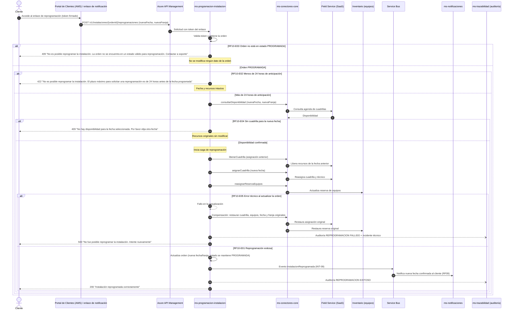

# Diagrama de Secuencia — RF10 Reprogramar instalación del servicio de internet

Cubre: RF10-E01 (reprogramación exitosa), RF10-E02 (fuera de plazo de 24 h), RF10-E03 (estado no reprogramable), RF10-E04 (sin disponibilidad), RF10-E05 (error técnico con reversión).

