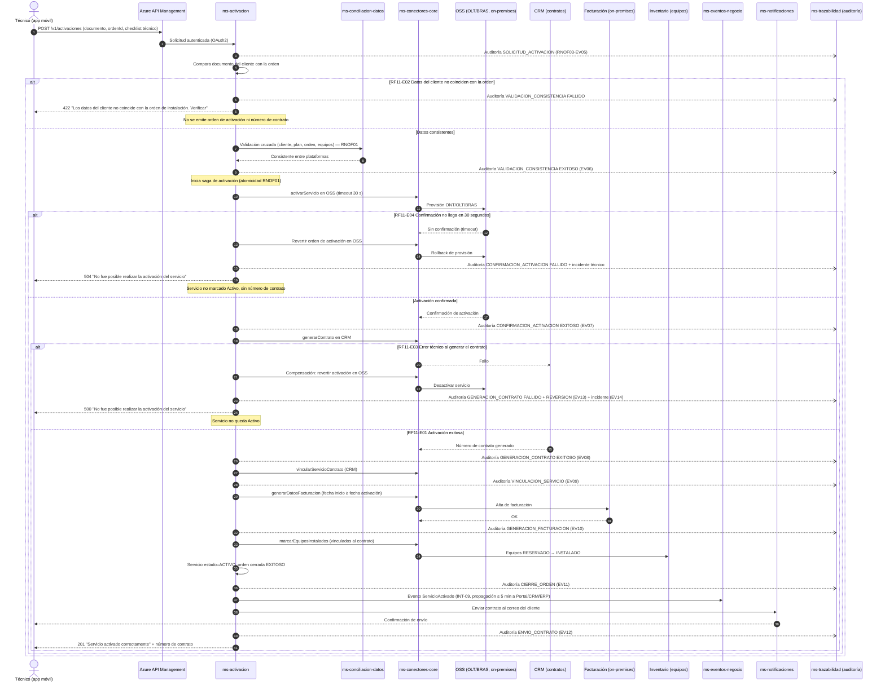

# Diagrama de Secuencia — RF11 Activar el servicio de internet contratado

Cubre: RF11-E01 (activación exitosa), RF11-E02 (datos incorrectos), RF11-E03 (error al generar contrato con reversión), RF11-E04 (sin confirmación del OSS en 30 s con reversión).

