# Diagrama de Secuencia - RF12: Correlación de Incidentes de Red con Clientes Afectados

## Descripción
Flujo completo de correlación automática de alarmas de red, identificación de clientes afectados y gestión de incidentes maestros con notificaciones proactivas.

## Diagrama de Secuencia

```mermaid
sequenceDiagram
    participant NMS as NMS Regional
    participant EventBus as Event Bus (Pub/Sub)
    participant ICS as Incident Correlation Service
    participant Oracle as Inventario Oracle
    participant CRM as CRM SaaS
    participant ITSM as ITSM Azure
    participant Notify as Servicio Notificación
    participant IVR as Sistema IVR
    participant Portal as Portal Cliente
    participant NOC as Operador NOC
    participant Cliente as Cliente
    participant Audit as Servicio Auditoría
    participant Obs as Plataforma Observabilidad

    Note over NMS, Obs: RF12-ESC01: Una falla grande se registra como un solo incidente

    NMS->>EventBus: Múltiples alarmas simultáneas
    Note right of NMS: Corte fibra principal - 2,847 alarmas en 30s
    
    EventBus->>ICS: Stream de eventos de red
    Note right of EventBus: {alarmId, nodeId, alarmType, severity, timestamp}
    
    ICS->>ICS: Aplicar filtros de deduplicación
    Note right of ICS: Descartar duplicados del mismo equipo
    
    loop Para cada alarma única
        ICS->>ICS: Verificar si ya está correlacionada
        Note right of ICS: Hash por (nodeId + alarmType + ventana_tiempo)
        
        alt Alarma nueva (no correlacionada)
            ICS->>Oracle: Consultar topología de red
            Oracle-->>ICS: Dependencias downstream del nodo
            
            ICS->>ICS: Mapear equipos afectados en cascada
            Note right of ICS: Nodo padre caído → CTOs + puertos hijo
            
            ICS->>ICS: Agregar a correlación existente
            Note right of ICS: Mismo incident_master_id
        else Alarma ya correlacionada
            ICS->>ICS: Incrementar contador de alarmas
            ICS->>Obs: Log alarma duplicada descartada
        end
    end
    
    ICS->>CRM: Identificar servicios activos en infraestructura
    Note right of CRM: Consultar por nodeIds afectados
    CRM-->>ICS: Lista de clientes con servicios activos
    
    ICS->>ICS: Clasificar clientes por tipo y SLA
    Note right of ICS: 1,240 residenciales + 38 empresariales (5 críticos)
    
    ICS->>ICS: Evaluar criterios de incidente maestro
    Note right of ICS: >100 clientes = incidente masivo
    
    alt Califica como incidente maestro
        ICS->>ITSM: Crear incidente maestro
        Note right of ITSM: Prioridad ALTA, categoría MASSIVE_OUTAGE
        ITSM-->>ICS: Ticket INC-2024-001234 creado
        
        ICS->>Audit: Registrar incidente maestro creado
        Note right of Audit: <5min desde primera alarma
        
        ICS->>NOC: Notificar incidente crítico
        Note right of NOC: Dashboard actualizado automáticamente
    else No califica para incidente maestro
        ICS->>ICS: Crear alarmas individuales
        ICS->>Audit: Registrar como falla localizada
    end

    Note over NMS, Obs: RF12-ESC02: Notificación proactiva a clientes afectados

    NOC->>ITSM: Confirma incidente maestro
    ITSM->>EventBus: Evento MASTER_INCIDENT_CONFIRMED
    
    EventBus->>ICS: Procesar confirmación
    ICS->>ICS: Activar notificaciones proactivas
    
    par Notificaciones Multi-Canal
        ICS->>Notify: Enviar push notifications (app)
        Note right of Notify: "Falla masiva en su zona - ETA 4 horas"
        and
        ICS->>Notify: Enviar SMS masivo
        Note right of Notify: Batch prioritizado por tipo de cliente
        and
        ICS->>IVR: Actualizar mensaje contextual
        Note right of IVR: Script específico para zona afectada
        and
        ICS->>Portal: Mostrar banner de falla masiva
        Note right of Portal: Solo visible para clientes afectados
    end
    
    Notify->>Notify: Segmentar por prioridad de cliente
    Note right of Notify: Empresariales primero, luego residenciales
    
    loop Para cada cliente afectado
        Notify->>Notify: Generar mensaje personalizado
        Note right of Notify: Incluir ETA específico por zona
        
        Notify->>Cliente: Enviar notificación
        Cliente->>Cliente: Recibe aviso proactivo
        
        Notify->>ICS: Registrar entrega exitosa/fallida
    end
    
    ICS->>Audit: Registrar métricas de notificación
    Note right of Audit: 1,278 enviadas, 1,201 entregadas, 77 fallos

    Note over NMS, Obs: RF12-ESC03: Cliente que llama recibe información sin esperar agente

    Cliente->>IVR: Llama al call center
    IVR->>IVR: Reconocer número del cliente
    
    IVR->>ICS: ¿Cliente en lista de afectados?
    Note right of IVR: {customerPhone, currentTime}
    
    ICS->>ICS: Verificar cliente en incidente activo
    Note right of ICS: Buscar en tabla affected_customers
    
    alt Cliente afectado por incidente maestro
        ICS-->>IVR: Cliente confirmado en incidente INC-001234
        
        IVR->>Cliente: "Su zona tiene falla masiva confirmada"
        IVR->>Cliente: "Tiempo estimado de resolución: 3 horas"
        IVR->>Cliente: "¿Desea recibir actualizaciones por SMS?"
        
        Cliente->>IVR: "Sí, quiero actualizaciones"
        IVR->>ICS: Suscribir a notificaciones
        ICS->>Notify: Agregar a lista de seguimiento
        
        IVR->>Cliente: "Registrado para actualizaciones automáticas"
    else Cliente NO afectado
        IVR->>Cliente: Menú normal de atención
        IVR->>Cliente: "¿En qué podemos ayudarle?"
    end

    Note over NMS, Obs: RF12-ESC04: Cierre de incidente maestro con resolución en cascada

    NOC->>NOC: Confirma reparación técnica
    NOC->>ITSM: Marcar incidente como resuelto
    Note right of ITSM: INC-001234 → RESOLVED
    
    ITSM->>EventBus: Evento MASTER_INCIDENT_RESOLVED
    EventBus->>ICS: Procesar resolución de incidente
    
    ICS->>ICS: Obtener tickets hijos vinculados
    Note right of ICS: 89 tickets individuales asociados
    
    par Cierre en Cascada
        loop Para cada ticket hijo
            ICS->>ITSM: Cerrar ticket automáticamente
            ITSM-->>ICS: Ticket cerrado con resolución automática
        end
        and
        ICS->>Notify: Enviar notificaciones de restablecimiento
        Note right of Notify: "Servicio restablecido en su zona"
        and
        ICS->>Portal: Remover banner de falla
        and
        ICS->>IVR: Restaurar mensajes normales
    end
    
    ICS->>ICS: Calcular métricas finales del incidente
    Note right of ICS: Duración: 3h 42min, clientes: 1,278
    
    ICS->>Obs: Publicar indicadores de incidente
    Note right of Obs: SLA, MTTR, satisfacción, prevención de llamadas
    
    ICS->>Audit: Registrar cierre completo
    ICS->>NOC: Notificar cierre exitoso

    Note over NMS, Obs: RF12-ESC05: Alarma sin correlación por inventario desactualizado

    NMS->>EventBus: Alarma de nodo desconocido
    Note right of NMS: {nodeId: "NODE-9999", alarmType: "FIBER_CUT"}
    
    EventBus->>ICS: Procesar alarma
    ICS->>Oracle: Consultar información del nodo
    Oracle-->>ICS: Nodo no encontrado en inventario
    
    ICS->>ICS: Clasificar como no correlacionable
    Note right of ICS: Sin datos de topología para correlacionar
    
    ICS->>ICS: Crear registro de pendiente manual
    ICS->>Audit: Registrar discrepancia de inventario
    
    ICS->>NOC: Alertar inconsistencia de datos
    Note right of NOC: "Alarma no correlacionable - inventario desactualizado"
    
    ICS->>Obs: Métricas de calidad de datos
    Note right of Obs: Porcentaje de alarmas no correlacionables

    Note over NMS, Obs: RF12-ESC06: Descarte de eventos duplicados o irrelevantes

    NMS->>EventBus: Múltiples eventos del mismo equipo
    Note right of NMS: 15 alarmas idénticas en 5 minutos
    
    EventBus->>ICS: Stream de eventos
    
    loop Para cada evento entrante
        ICS->>ICS: Calcular hash de deduplicación
        Note right of ICS: MD5(nodeId + alarmType + ventana_5min)
        
        alt Hash ya existe (duplicado)
            ICS->>ICS: Incrementar contador de ocurrencias
            ICS->>Obs: Log evento duplicado descartado
            Note right of ICS: No crear nueva correlación
        else Hash único (evento nuevo)
            ICS->>ICS: Procesar correlación normal
            ICS->>Audit: Registrar nuevo evento único
        end
    end

    Note over NMS, Obs: RF12-ESC07: Falla en entrega de notificaciones proactivas

    ICS->>Notify: Enviar notificaciones masivas
    Note right of ICS: 1,278 clientes a notificar
    
    Notify->>Notify: Procesar lote de notificaciones
    
    loop Para cada canal de notificación
        alt Canal SMS disponible
            Notify->>Cliente: Enviar SMS exitosamente
            Notify->>ICS: Confirmar entrega SMS
        else Canal SMS no disponible
            Notify->>Notify: Registrar fallo de canal
            Notify->>Notify: Reintentar según política
            
            alt Reintentos agotados
                Notify->>ICS: Reportar fallo permanente
                ICS->>Audit: Registrar cliente no notificado
                ICS->>NOC: Alertar fallo de notificaciones
            end
        end
    end
    
    ICS->>ICS: Calcular tasa de entrega exitosa
    Note right of ICS: 94.2% entrega exitosa
    
    alt Tasa < 90%
        ICS->>Obs: Alerta crítica de notificaciones
        ICS->>NOC: Escalamiento por fallo masivo
    end

    Note over NMS, Obs: RF12-ESC08: Umbral no alcanzado para incidente masivo

    NMS->>EventBus: Alarmas de falla localizada
    Note right of NMS: 25 alarmas de nodo local
    
    EventBus->>ICS: Eventos de falla menor
    ICS->>Oracle: Consultar topología afectada
    Oracle-->>ICS: Impacto limitado a 1 CTO
    
    ICS->>CRM: Consultar clientes afectados
    CRM-->>ICS: 12 clientes residenciales
    
    ICS->>ICS: Evaluar criterios de incidente maestro
    Note right of ICS: 12 clientes < umbral 100
    
    ICS->>ICS: NO crear incidente maestro
    ICS->>ICS: Generar alarmas individuales
    
    ICS->>Audit: Registrar falla localizada
    ICS->>NOC: Mostrar en dashboard como falla menor
    
    Note right of ICS: Visible para soporte primer nivel

    Note over NMS, Obs: RF12-ESC09: Error técnico durante creación de incidente maestro

    ICS->>ICS: Falla masiva identificada y validada
    Note right of ICS: 1,500+ clientes afectados
    
    ICS->>ITSM: Crear incidente maestro crítico
    Note right of ITSM: Falla de conexión a base de datos
    ITSM--xICS: Database connection failed
    
    ICS->>ICS: Manejar fallo de creación
    ICS->>ICS: Conservar correlación en cola de reproceso
    
    ICS->>NOC: Alertar fallo crítico de ITSM
    Note right of NOC: "Correlación lista pero ITSM no disponible"
    
    ICS->>Audit: Registrar fallo de integración
    ICS->>Obs: Alerta crítica de infraestructura
    
    loop Reintentos de creación (cada 2 min)
        ICS->>ITSM: Reintentar creación de incidente
        alt ITSM restaurado
            ITSM-->>ICS: Incidente creado exitosamente
            ICS->>ICS: Procesar notificaciones pendientes
        else ITSM aún no disponible
            ICS->>Obs: Log reintento fallido
        end
    end

    Note over NMS, Obs: Métricas y Monitoreo Continuo de Correlación

    loop Procesamiento en tiempo real
        ICS->>Obs: Métricas de tiempo de correlación
        ICS->>Obs: Tasa de deduplicación efectiva
        ICS->>Obs: Precisión de identificación de clientes
        ICS->>Obs: Efectividad de notificaciones proactivas
        ICS->>Obs: Reducción de volumen de llamadas
        Audit->>Obs: Volumen de incidentes por severidad
    end
    
    ICS->>Obs: Dashboard NOC en tiempo real
    Note right of Obs: Incidentes activos, clientes afectados, ETA
    
    ICS->>Obs: KPIs de prevención de llamadas
    Note right of Obs: % reducción vs. histórico sin notificación
    
    ICS->>Obs: Alertas por patrones anómalos
    Note right of Obs: Spike de alarmas, degradación correlación
```

## Escenarios Cubiertos

### ESC01: Una Falla Grande como Un Solo Incidente
- **Deduplicación Inteligente**: Agrupa miles de alarmas relacionadas
- **Análisis de Topología**: Identifica cascada de equipos afectados
- **Umbral Automático**: >100 clientes = incidente maestro
- **Creación en <5min**: SLA de detección y registro cumplido

### ESC02: Notificación Proactiva a Clientes Afectados
- **Multi-Canal**: App, SMS, email con priorización por tipo de cliente
- **Mensajes Contextuales**: ETA específico por zona afectada
- **Segmentación**: Empresariales críticos primero
- **Actualización de IVR**: Scripts dinámicos por zona

### ESC03: Cliente Recibe Información Sin Agente
- **Reconocimiento Automático**: Identificación por número telefónico
- **Información Inmediata**: Estado y ETA sin espera
- **Suscripción Opcional**: Actualizaciones automáticas por SMS
- **Deflección de Llamadas**: Reducción significativa de volumen

### ESC04: Cierre en Cascada
- **Resolución Automática**: 89 tickets hijos cerrados automáticamente
- **Notificación de Restablecimiento**: Multi-canal coordinado
- **Métricas Finales**: MTTR, SLA, satisfacción calculados
- **Restauración de Sistemas**: IVR y portal normalizados

### ESC05: Alarma Sin Correlación
- **Detección de Inconsistencias**: Inventario desactualizado identificado
- **Cola de Revisión Manual**: Escalamiento para saneamiento
- **Métricas de Calidad**: Porcentaje de alarmas correlacionables
- **Mejora Continua**: Identificación de gaps de datos

### ESC06: Descarte de Duplicados
- **Hash de Deduplicación**: Algoritmo eficiente por ventana de tiempo
- **Contadores de Ocurrencia**: Sin perder información de frecuencia
- **Performance**: Reducción drástica de procesamiento redundante

### ESC07: Falla en Notificaciones
- **Reintentos Controlados**: Políticas específicas por canal
- **Métricas de Entrega**: Tasa de éxito monitoreada en tiempo real
- **Escalamiento**: Alertas críticas por degradación masiva
- **Canales Alternativos**: Fallback automático entre medios

### ESC08: Umbral No Alcanzado
- **Clasificación Inteligente**: Fallas localizadas vs. masivas
- **Visibilidad Diferenciada**: Dashboard NOC vs. soporte L1
- **Sin Notificaciones Masivas**: Evita spam por fallas menores

### ESC09: Error en Creación de Incidente
- **Cola de Reproceso**: Conservación de correlación para retry
- **Alertamiento Inmediato**: NOC notificado de fallo crítico
- **Reintentos Automáticos**: Procesamiento cuando ITSM se restaure
- **Fallback Manual**: NOC puede intervenir si necesario

## Lineamientos Aplicados

- **OBS-08**: Correlación automática con contexto completo de cliente
- **OBS-13**: Integración completa con NOC para visibilidad operacional  
- **OBS-14**: Integración con ITSM para gestión automática de tickets
- **ARQ-03**: Responsabilidad especializada en correlación de eventos
- **ESC-05**: Procesamiento asíncrono de notificaciones masivas
- **INT-17**: Arquitectura completamente basada en eventos
- **OBS-15**: Cumplimiento de SLAs de detección (<5min) y notificación