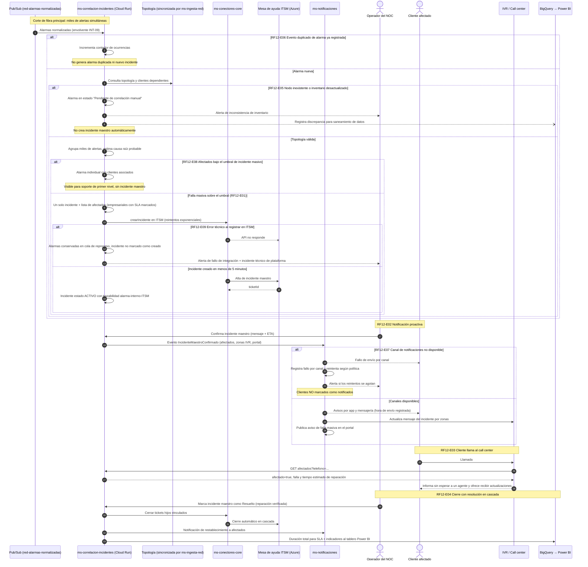

# Diagrama de Secuencia — RF12 Correlación de incidentes de red con clientes afectados

Cubre: RF12-E01 (incidente único por falla masiva), RF12-E02 (notificación proactiva), RF12-E03 (IVR reconoce al cliente), RF12-E04 (cierre en cascada), RF12-E05 (inventario desactualizado), RF12-E06 (deduplicación), RF12-E07 (falla de canal de notificación), RF12-E08 (umbral no alcanzado), RF12-E09 (error técnico en ITSM).

