# Diagrama de Arquitectura Multinube — FiberLink Andina Telecom

Arquitectura de alto nivel de la solución (iniciativas 1, 2 y 3): Plataforma de Integración Empresarial, automatización de procesos operativos y plataforma de observabilidad. Distribución por nube según los lineamientos de stack tecnológico:

- **Azure** — exposición y gobierno de APIs, capa de integración empresarial y microservicios de negocio (`stack_tecnologico_azure.md`).
- **GCP** — bus de eventos, analítica, trazabilidad y observabilidad (`stack_tecnologico_gcp.md`).
- **AWS** — huella existente del Portal de Clientes (`stack_tecnologico_aws.md`).
- **On-premises / SaaS** — sistemas core existentes que la solución integra sin reemplazar (INT-07: nunca se integran directamente entre sí para nuevos flujos; todo pasa por la plataforma de integración).

```mermaid
flowchart TB

    %% ==================== CANALES ====================
    subgraph CANALES["Canales"]
        APPM["App Móvil"]
        TABV["Tablets vendedores de campo<br/>(sincronización offline)"]
        APPT["App técnicos de campo"]
        CALL["Call Center"]
    end

    %% ==================== AWS ====================
    subgraph AWS["AWS — Portal de Clientes (huella existente)"]
        CDN["CloudFront (CDN) + WAF"]
        PORTAL["Portal de Clientes<br/>ECS Fargate (tráfico constante 24/7)"]
        AURORA[("Aurora PostgreSQL")]
        REDIS[("ElastiCache Redis<br/>caché de sesiones y consultas")]
        CW["CloudWatch"]
    end

    %% ==================== AZURE ====================
    subgraph AZURE["Azure — Exposición de APIs e Integración Empresarial"]
        AGW["Application Gateway + WAF"]
        APIM["Azure API Management<br/>APIs versionadas /v1, rate limiting"]
        ENTRA["Microsoft Entra ID<br/>OAuth2 / scopes"]
        KV["Key Vault<br/>secretos y credenciales técnicas"]

        subgraph MSCA["Microservicios — Azure Container Apps (tráfico constante)"]
            SOL["ms-solicitudes (RF01)"]
            COB["ms-cobertura (RF03)"]
            CAP["ms-capacidad (RF04)"]
            EST["ms-estado-servicio (RF05)"]
            PRG["ms-programacion-instalacion<br/>(RF08 / RF10)"]
            ACT["ms-activacion (RF11)"]
            CONN["ms-conectores-core (RF02)<br/>único acceso a sistemas core"]
        end

        subgraph MSFN["Microservicios — Azure Functions (carga intermitente)"]
            EVT["ms-eventos-negocio (RF06)"]
            NOTI["ms-notificaciones (RF09)"]
            CONC["ms-conciliacion-datos (RNOF01)"]
        end

        SB["Azure Service Bus<br/>colas, tópicos y DLQ"]
        ASQL[("Azure SQL<br/>BD por microservicio")]
        ORDDB[("Gestión de Órdenes<br/>Azure SQL (existente)")]
        ITSM["Mesa de ayuda / ITSM (existente)"]
        APPINS["Application Insights<br/>+ Azure Monitor + Log Analytics"]
        PBI["Power BI (tableros ejecutivos)"]
    end

    %% ==================== GCP ====================
    subgraph GCP["GCP — Eventos, Analítica y Observabilidad"]
        PSNEG["Pub/Sub<br/>bus de eventos de negocio"]
        PSRED["Pub/Sub — tópicos de red<br/>ingesta cruda / alarmas normalizadas / DLQ"]

        subgraph MSCR["Microservicios — Cloud Run (procesamiento continuo)"]
            TRZ["ms-trazabilidad<br/>(RF07 / RNOF03)"]
            ING["ms-ingesta-red (RNOF04)"]
            CORR["ms-correlacion-incidentes (RF12)"]
        end

        SCHED["Cloud Scheduler<br/>sincronización de topología"]
        BQ[("BigQuery<br/>trazas, auditoría, eventos de red, KPIs")]
        WORM[("Cloud Storage<br/>auditoría WORM inmutable, 5 años")]
        CHURN["Modelo de churn (existente)"]
        GLOG["Cloud Logging + Monitoring"]
    end

    %% ==================== ON-PREMISES ====================
    subgraph ONPREM["On-Premises — Data Centers FiberLink"]
        ORACLE[("Inventario de Red — Oracle<br/>nodos, CTO, puertos, splitters")]
        OSS["OSS/OCS de provisión<br/>OLT / BRAS / autenticación"]
        FACT["Facturación<br/>Unix heredado"]
        ERP["ERP e inventario de equipos"]
        NMS["NMS regionales + logs de red"]
        GIS["GIS heredado (shapefiles)"]
    end

    %% ==================== SAAS ====================
    subgraph SAAS["SaaS externos"]
        CRM["CRM Comercial"]
        FSERV["Field Service<br/>agenda de cuadrillas"]
        MKTG["Marketing<br/>campañas de retención"]
        PAGOS["Pasarelas de pago"]
        MSGPROV["Proveedores correo /<br/>WhatsApp / push"]
    end

    %% ==================== FLUJOS: CANALES Y PORTAL ====================
    CDN --> PORTAL
    PORTAL --> AURORA
    PORTAL --> REDIS
    PORTAL -->|"pagos"| PAGOS
    APPM --> AGW
    TABV --> AGW
    APPT --> AGW
    PORTAL -->|"APIs de negocio"| AGW
    CALL --> ITSM
    AGW --> APIM
    APIM -->|"valida token y scopes"| ENTRA

    %% ==================== FLUJOS: APIS SÍNCRONAS (INT-01) ====================
    APIM --> SOL
    APIM --> COB
    APIM --> CAP
    APIM --> EST
    APIM --> PRG
    APIM --> ACT
    APIM -->|"consulta de trazas<br/>y auditoría"| TRZ

    SOL -->|"valida cobertura"| COB
    SOL -->|"valida y reserva capacidad"| CAP
    MSCA --> ASQL
    MSFN --> ASQL
    MSCA -.->|"secretos"| KV

    %% ==================== PLATAFORMA DE INTEGRACIÓN (INT-07) ====================
    SOL --> CONN
    PRG --> CONN
    ACT --> CONN
    CONC --> CONN
    CONN -->|"VPN / ExpressRoute<br/>(SEG-10)"| ORACLE
    CONN -->|"VPN / ExpressRoute"| OSS
    CONN -->|"VPN / ExpressRoute"| FACT
    CONN -->|"VPN / ExpressRoute"| ERP
    CONN --> CRM
    CONN --> FSERV
    CONN --> GIS
    CONN --> ITSM
    CONN --> ORDDB

    %% ==================== FLUJOS: EVENTOS ASÍNCRONOS (INT-02, INT-09) ====================
    MSCA -->|"publican eventos<br/>de negocio"| EVT
    EVT --> SB
    EVT --> PSNEG
    SB --> NOTI
    SB -->|"proyección de estado 360"| EST
    SB -->|"sincroniza réplicas de<br/>cobertura y capacidad"| COB
    SB --> CAP
    SB -->|"disparo por timer<br/>y eventos"| CONC
    NOTI --> MSGPROV
    PSNEG --> TRZ
    TRZ --> BQ
    TRZ -->|"copia inmutable<br/>(RNOF03)"| WORM

    %% ==================== OBSERVABILIDAD DE RED (RNOF04 / RF12) ====================
    NMS -->|"alarmas y logs"| PSRED
    SCHED --> ING
    PSRED -->|"ingesta cruda"| ING
    ING -->|"alarmas normalizadas"| PSRED
    PSRED -->|"alarmas normalizadas"| CORR
    ING --> BQ
    CORR --> BQ
    CORR -->|"tickets proactivos<br/>vía conector ITSM"| CONN
    CORR -->|"avisos proactivos<br/>a clientes"| NOTI

    %% ==================== ANALÍTICA Y RETENCIÓN ====================
    BQ --> PBI
    BQ --> CHURN
    CHURN -->|"propensión de churn"| CRM
    CRM --> MKTG

    %% ==================== OBSERVABILIDAD TÉCNICA (OBS-01..07) ====================
    MSCA -.->|"logs, métricas, trazas<br/>con correlationId"| APPINS
    MSFN -.-> APPINS
    APIM -.-> APPINS
    MSCR -.-> GLOG
    PORTAL -.-> CW

    %% ==================== ESTILOS ====================
    style AWS fill:#fff3e0,stroke:#e65100,stroke-width:2px
    style AZURE fill:#e3f2fd,stroke:#0d47a1,stroke-width:2px
    style GCP fill:#e8f5e9,stroke:#1b5e20,stroke-width:2px
    style ONPREM fill:#eceff1,stroke:#37474f,stroke-width:2px
    style SAAS fill:#f3e5f5,stroke:#6a1b9a,stroke-width:2px
    style CANALES fill:#fffde7,stroke:#f57f17,stroke-width:2px
    style MSCA fill:#bbdefb,stroke:#1565c0
    style MSFN fill:#b3e5fc,stroke:#0277bd
    style MSCR fill:#c8e6c9,stroke:#2e7d32
```

## Lectura del diagrama

### Capa de exposición (Azure)

Todo consumo de APIs de negocio —App Móvil, tablets de campo, app de técnicos y el propio Portal de Clientes en AWS— entra por **Application Gateway + WAF** y **Azure API Management**, que aplica OAuth2 con Microsoft Entra ID, scopes por consumidor, versionamiento `/v1` y rate limiting (INT-01, SEG-03, SEG-04, SEG-07). Las reglas de negocio viven en los microservicios, nunca en los canales (ARQ-06).

### Plataforma de Integración Empresarial (iniciativa 1)

`ms-conectores-core` es el **único punto de acceso** a los sistemas core (CRM, Inventario Oracle, OSS/OCS, Facturación, ERP), cumpliendo INT-07 y ARQ-02. Media protocolos (REST, SOAP, JDBC, archivos), aplica timeout, reintentos y circuit breaker por sistema (INT-03), registra evidencias de intercambio (INT-08) y llega a los sistemas on-premises por canal privado VPN/ExpressRoute (SEG-10).

### Automatización operativa (iniciativa 2)

Los microservicios de dominio en Azure Container Apps (`ms-solicitudes`, `ms-cobertura`, `ms-capacidad`, `ms-estado-servicio`, `ms-programacion-instalacion`, `ms-activacion`) automatizan el flujo captación → instalación → activación. Los procesos de carga intermitente corren en Azure Functions (`ms-eventos-negocio`, `ms-notificaciones`, `ms-conciliacion-datos`), según el criterio de runtime por patrón de tráfico (ARQ-08, ESC-03).

### Eventos de negocio (INT-02, INT-09)

`ms-eventos-negocio` publica en **doble broker**: Azure Service Bus para la distribución interna (notificaciones, proyecciones de estado, sincronización de réplicas de lectura) y **GCP Pub/Sub** como bus de eventos para analítica, trazabilidad y suscriptores. Todo evento incluye `eventId`, `eventType`, `version`, `correlationId`, `sourceSystem`, `timestamp` y `payload` (INT-09), y las colas cuentan con DLQ y reproceso controlado (INT-11).

### Plataforma de observabilidad (iniciativa 3)

- `ms-ingesta-red` normaliza alarmas y logs de los NMS regionales hacia Pub/Sub y BigQuery (RNOF04).
- `ms-correlacion-incidentes` cruza alarmas con la topología y clientes afectados, abre tickets proactivos en ITSM y dispara avisos a clientes (RF12).
- `ms-trazabilidad` consolida trazas de integración y auditoría en BigQuery, con copia WORM inmutable en Cloud Storage por 5 años (RF07, RNOF03, OBS-10).
- Telemetría técnica: Application Insights/Log Analytics en Azure, Cloud Logging/Monitoring en GCP y CloudWatch en AWS, con `correlationId` propagado extremo a extremo (OBS-01, OBS-02, OBS-06); tableros en Power BI (OBS-07).

### AWS (huella existente)

El Portal de Clientes se mantiene en AWS: CloudFront + WAF, cómputo en ECS Fargate (tráfico constante 24/7, según criterio del stack AWS), Aurora PostgreSQL y ElastiCache Redis (ESC-04). Para los nuevos flujos el portal consume exclusivamente las APIs de negocio publicadas en API Management — sin integraciones directas a sistemas core.

## Lineamientos cubiertos por el diagrama

ARQ-01, ARQ-02, ARQ-06, ARQ-08, ARQ-09 · ESC-03, ESC-04, ESC-05, ESC-06, ESC-10 · INT-01, INT-02, INT-03, INT-07, INT-08, INT-09, INT-11 · OBS-01, OBS-02, OBS-06, OBS-07, OBS-10 · SEG-03, SEG-04, SEG-05, SEG-07, SEG-10 · Stacks: `stack_tecnologico_aws.md`, `stack_tecnologico_azure.md`, `stack_tecnologico_gcp.md`.

El detalle de contratos, esquemas SQL, pseudocódigo y escenarios Gherkin por microservicio está en `diseño/alto_nivel/microservicios/`; los flujos por requerimiento están en `diseño/alto_nivel/diagramas_secuencia/`. Las decisiones que sustentan esta arquitectura están en `decisiones_diseño.md` (ARQ-10).
