# Diagrama de Arquitectura Multinube Cloud-Native (AWS + Azure) — FiberLink Andina Telecom

Arquitectura **cloud-native** de la Plataforma de Integración Empresarial y las mejoras operativas, en un entorno multinube restringido a **AWS y Azure**. La solución minimiza la dependencia de sistemas on-premises y SaaS externos: las capacidades de negocio corren como microservicios y servicios administrados en la nube; on-premises queda reducido a la red física (OLT/BRAS) con adaptadores de borde, y como externos permanecen solo los irreemplazables por naturaleza.

Distribución de roles por nube:

- **Azure** — exposición y gobierno de APIs, capa de integración y microservicios de negocio, incluidos los dominios de inventario de red, agenda de cuadrillas, facturación e inventario de equipos (`stack_tecnologico_azure.md`).
- **AWS** — Portal de Clientes, bus de eventos, streaming de red, trazabilidad, auditoría, datos geoespaciales y analítica (`stack_tecnologico_aws.md`).
- **Edge on-premises (mínimo irreducible)** — OLT/BRAS y adaptadores de provisión/telemetría: la red física no puede migrar.
- **Externos mínimos** — CRM SaaS, pasarelas de pago y proveedor WhatsApp.

> Este diagrama representa únicamente el **estado objetivo**. La ruta para llegar a él desde los sistemas actuales se documenta aparte, en `../decisiones_diseño.md` (D10); el criterio de mapeo de los componentes que antes residían en GCP está en D2.

```mermaid
flowchart TB

    %% ==================== CANALES ====================
    subgraph CANALES["Canales"]
        APPM["App Móvil"]
        TABV["Tablets vendedores de campo<br/>(sincronización offline)"]
        APPT["App técnicos de campo"]
        CALL["Call Center"]
    end

    %% ==================== AZURE ====================
    subgraph AZURE["Azure — Exposición de APIs, Integración y Microservicios de Negocio"]
        AGW["Application Gateway + WAF"]
        APIM["Azure API Management<br/>APIs versionadas /v1, rate limiting"]
        ENTRA["Microsoft Entra ID<br/>OAuth2 / scopes"]
        KV["Key Vault<br/>secretos y credenciales técnicas"]

        subgraph MSCA["Microservicios de dominio — Azure Container Apps"]
            SOL["ms-solicitudes (RF01)"]
            COB["ms-cobertura (RF03)"]
            CAP["ms-capacidad (RF04)"]
            EST["ms-estado-servicio (RF05)"]
            PRG["ms-programacion-instalacion<br/>(RF08 / RF10)"]
            ACT["ms-activacion (RF11)"]
            CONN["ms-conectores-core (RF02)<br/>único acceso a externos y edge"]
        end

        subgraph MSNEW["Microservicios de dominios operativos — Azure Container Apps"]
            INV["ms-inventario-red<br/>nodos, CTO, puertos, topología"]
            AGN["ms-agenda-cuadrillas<br/>citas y rutas de técnicos"]
            FACTMS["ms-facturacion<br/>planes y ciclos de cobro"]
            EQP["ms-inventario-equipos<br/>ONT / router, series"]
        end

        subgraph MSFN["Microservicios — Azure Functions (carga intermitente)"]
            EVT["ms-eventos-negocio (RF06)"]
            NOTI["ms-notificaciones (RF09)"]
            CONC["ms-conciliacion-datos (RNOF01)"]
        end

        SB["Azure Service Bus<br/>colas, tópicos y DLQ"]
        ASQL[("Azure SQL / SQL MI<br/>BD por microservicio")]
        ORDDB[("Gestión de Órdenes<br/>Azure SQL (existente)")]
        ITSM["Mesa de ayuda / ITSM<br/>(existente, ya en Azure)"]
        APPINS["Application Insights<br/>+ Azure Monitor + Log Analytics"]
        PBI["Power BI (tableros ejecutivos)"]
    end

    %% ==================== AWS ====================
    subgraph AWS["AWS — Portal de Clientes, Eventos, Trazabilidad, Geoespacial y Analítica"]

        subgraph AWSPORTAL["Portal de Clientes (huella existente)"]
            CDN["CloudFront (CDN) + WAF"]
            PORTAL["Portal de Clientes<br/>ECS Fargate (tráfico constante 24/7)"]
            AURORA[("Aurora PostgreSQL")]
            REDIS[("ElastiCache Redis<br/>caché de sesiones y consultas")]
        end

        subgraph AWSEVT["Bus de eventos y streaming"]
            EB["Amazon EventBridge<br/>bus de eventos de negocio"]
            SQSQ["Amazon SQS<br/>colas de suscriptores + DLQ"]
            KDSRAW["Kinesis Data Streams<br/>red-ingesta-cruda (2.6M eventos/hora)"]
            KDSNORM["Kinesis Data Streams<br/>red-alarmas-normalizadas"]
            FIREHOSE["Kinesis Data Firehose<br/>carga por lotes al data lake"]
            EBSCHED["EventBridge Scheduler<br/>sincronización de topología"]
        end

        subgraph MSAWS["Microservicios — ECS Fargate (procesamiento continuo 24/7)"]
            TRZ["ms-trazabilidad<br/>(RF07 / RNOF03)"]
            ING["ms-ingesta-red (RNOF04)"]
            CORR["ms-correlacion-incidentes (RF12)"]
        end

        subgraph AWSDATA["Datos, geoespacial y analítica"]
            LOCS["Location Service + S3<br/>datos geoespaciales y mapas"]
            S3LAKE[("S3 — data lake<br/>trazas y eventos de red")]
            S3WORM[("S3 Object Lock (WORM)<br/>auditoría inmutable, 5 años")]
            OPENS[("OpenSearch<br/>búsqueda por correlationId,<br/>sistema, cliente, fechas")]
            GLUE["Glue + Athena<br/>catálogo y consultas ad hoc"]
            REDSHIFT[("Redshift<br/>KPIs operativos y de negocio")]
            SAGE["SageMaker<br/>modelo de churn"]
        end

        subgraph AWSSEC["Seguridad y gobierno"]
            IAMSEC["IAM + KMS + Secrets Manager"]
            CTRAIL["CloudTrail (auditoría de accesos)"]
        end

        SNSN["SNS + SES<br/>push y correo transaccional"]
        CWX["CloudWatch + X-Ray"]
        GRAF["Grafana<br/>dashboards operativos unificados"]
    end

    %% ==================== EDGE ON-PREMISES (MÍNIMO) ====================
    subgraph EDGE["Edge on-premises — mínimo irreducible (red física)"]
        OSSADP["Adaptadores de provisión (edge)<br/>control plane en cloud"]
        OLT["OLT / BRAS<br/>elementos físicos de red"]
        COLL["Colectores de telemetría (edge)"]
    end

    %% ==================== EXTERNOS MÍNIMOS ====================
    subgraph EXTMIN["Externos mínimos (irreemplazables por naturaleza)"]
        CRMX["CRM Comercial (SaaS)"]
        PAGOS["Pasarelas de pago"]
        WAPP["Proveedor WhatsApp (Meta)"]
    end

    %% ==================== FLUJOS: CANALES Y PORTAL ====================
    CDN --> PORTAL
    PORTAL --> AURORA
    PORTAL --> REDIS
    PORTAL -->|"pagos"| PAGOS
    APPM --> AGW
    TABV --> AGW
    APPT --> AGW
    PORTAL -->|"APIs de negocio"| AGW
    CALL --> ITSM
    AGW --> APIM
    APIM -->|"valida token y scopes"| ENTRA

    %% ==================== FLUJOS: APIS SÍNCRONAS (INT-01) ====================
    APIM --> SOL
    APIM --> COB
    APIM --> CAP
    APIM --> EST
    APIM --> PRG
    APIM --> ACT
    APIM --> FACTMS
    APIM -->|"consulta de trazas<br/>y auditoría"| TRZ

    SOL -->|"valida cobertura"| COB
    SOL -->|"valida y reserva capacidad"| CAP
    COB -->|"cobertura, nodos, CTO"| INV
    COB -->|"geocodificación y mapas"| LOCS
    CAP -->|"puertos y capacidad"| INV
    PRG -->|"agenda cuadrilla"| AGN
    PRG -->|"reserva ONT / router"| EQP
    ACT -->|"alta de facturación"| FACTMS
    MSCA --> ASQL
    MSNEW --> ASQL
    MSFN --> ASQL
    MSCA -.->|"secretos"| KV

    %% ==================== INTEGRACIÓN CON EXTERNOS Y EDGE (INT-07) ====================
    SOL --> CONN
    ACT --> CONN
    CONN -->|"contratos y casos de venta"| CRMX
    CONN --> ORDDB
    CONN --> ITSM
    CONN -->|"VPN / ExpressRoute<br/>(SEG-10)"| OSSADP
    OSSADP -->|"provisión ONT / perfiles"| OLT

    %% ==================== FLUJOS: EVENTOS ASÍNCRONOS (INT-02, INT-09) ====================
    MSCA -->|"publican eventos<br/>de negocio"| EVT
    INV -->|"cambios de inventario<br/>y topología"| EVT
    EVT --> SB
    EVT -->|"bus de eventos para analítica,<br/>trazabilidad y suscriptores"| EB
    SB --> NOTI
    SB -->|"proyección de estado 360"| EST
    SB -->|"réplicas de lectura de<br/>cobertura y capacidad"| COB
    SB --> CAP
    SB -->|"disparo por timer<br/>y eventos"| CONC
    NOTI -->|"push y correo"| SNSN
    NOTI -->|"WhatsApp"| WAPP

    %% ==================== TRAZABILIDAD Y AUDITORÍA (RF07 / RNOF03) ====================
    EB -->|"trazas de integración<br/>y auditoría"| SQSQ
    SQSQ --> TRZ
    TRZ -->|"indexa para búsqueda<br/>(OBS-10)"| OPENS
    TRZ --> FIREHOSE
    FIREHOSE --> S3LAKE
    TRZ -->|"copia inmutable<br/>(RNOF03)"| S3WORM

    %% ==================== OBSERVABILIDAD DE RED (RNOF04 / RF12) ====================
    COLL -->|"alarmas y logs<br/>(Direct Connect / VPN)"| KDSRAW
    EBSCHED -->|"topología desde<br/>ms-inventario-red"| ING
    KDSRAW --> ING
    ING -->|"alarmas normalizadas"| KDSNORM
    ING -->|"rechazados a DLQ"| SQSQ
    KDSNORM --> CORR
    ING --> FIREHOSE
    CORR -->|"tickets proactivos<br/>vía conector ITSM"| CONN
    CORR -->|"avisos proactivos<br/>a clientes"| NOTI

    %% ==================== ANALÍTICA Y RETENCIÓN ====================
    S3LAKE --> GLUE
    GLUE --> REDSHIFT
    CORR -->|"KPIs de incidentes"| REDSHIFT
    REDSHIFT --> PBI
    S3LAKE --> SAGE
    SAGE -->|"propensión de churn"| CRMX

    %% ==================== OBSERVABILIDAD TÉCNICA (OBS-01..07) ====================
    MSCA -.->|"logs, métricas, trazas<br/>con correlationId"| APPINS
    MSNEW -.-> APPINS
    MSFN -.-> APPINS
    APIM -.-> APPINS
    MSAWS -.-> CWX
    PORTAL -.-> CWX
    CWX -.-> GRAF
    APPINS -.->|"vista unificada<br/>multinube"| GRAF
    MSAWS -.->|"credenciales y cifrado"| IAMSEC

    %% ==================== ESTILOS ====================
    style AWS fill:#fff3e0,stroke:#e65100,stroke-width:2px
    style AWSPORTAL fill:#ffe0b2,stroke:#ef6c00
    style AWSEVT fill:#ffecb3,stroke:#ff8f00
    style MSAWS fill:#ffcc80,stroke:#e65100
    style AWSDATA fill:#fff8e1,stroke:#ff8f00
    style AWSSEC fill:#ffe57f,stroke:#ff6f00
    style AZURE fill:#e3f2fd,stroke:#0d47a1,stroke-width:2px
    style MSCA fill:#bbdefb,stroke:#1565c0
    style MSNEW fill:#c5cae9,stroke:#283593
    style MSFN fill:#b3e5fc,stroke:#0277bd
    style EDGE fill:#eceff1,stroke:#37474f,stroke-width:2px
    style EXTMIN fill:#f3e5f5,stroke:#6a1b9a,stroke-width:2px
    style CANALES fill:#fffde7,stroke:#f57f17,stroke-width:2px
```

## Lectura del diagrama

### Principio rector: cloud-native, on-premises mínimo, externos mínimos

Todas las capacidades de negocio corren como microservicios y servicios administrados en AWS y Azure. Fuera de la nube quedan solo dos categorías: el **edge on-premises irreducible** (OLT/BRAS con sus adaptadores de provisión y colectores de telemetría — la red física no puede migrar) y los **externos irreemplazables** (CRM SaaS, pasarelas de pago y el proveedor WhatsApp exigido por Meta). El correo y el push se sirven con SNS + SES, sin proveedores externos adicionales.

### Capa de exposición (Azure)

Todo consumo de APIs —App Móvil, tablets de campo, app de técnicos y el propio Portal de Clientes en AWS— entra por Application Gateway + WAF y Azure API Management con OAuth2/Entra ID, scopes por consumidor, versionamiento `/v1` y rate limiting (INT-01, SEG-03, SEG-04, SEG-07). Las reglas de negocio viven en los microservicios, nunca en los canales (ARQ-06).

### Dominios operativos como microservicios cloud-native

Además de los microservicios de la plataforma de integración (`ms-solicitudes`, `ms-cobertura`, `ms-capacidad`, `ms-estado-servicio`, `ms-programacion-instalacion`, `ms-activacion`), cuatro dominios operativos corren como microservicios propios en Azure Container Apps:

- **`ms-inventario-red`** — fuente de verdad de nodos, CTO, puertos y topología; publica cada cambio como evento, de modo que cobertura, capacidad y el motor de correlación de incidentes trabajan siempre con datos frescos (elimina la causa raíz de la sobreventa y de los puertos inexistentes).
- **`ms-agenda-cuadrillas`** — citas, franjas y rutas de técnicos, con reserva transaccional integrada a la saga de `ms-programacion-instalacion` (ataca el 22% de reprogramaciones).
- **`ms-facturacion`** — planes, ciclos y alta de facturación invocada atómicamente por `ms-activacion` (cierra la brecha técnico/comercial de 38,000 servicios).
- **`ms-inventario-equipos`** — ONT/router y series, reservados al programar la instalación.

Los datos geoespaciales (mapas, geocodificación) se sirven desde **Location Service + S3** en AWS. Los procesos de carga intermitente corren en Azure Functions (`ms-eventos-negocio`, `ms-notificaciones`, `ms-conciliacion-datos`), según el criterio de runtime por patrón de tráfico (ARQ-08, ESC-03).

### Integración con externos y edge (INT-07)

`ms-conectores-core` es el **único punto de acceso** a lo que queda fuera de la malla cloud: CRM SaaS, gestión de órdenes, ITSM y los adaptadores de provisión del edge. Media protocolos, aplica timeout/reintentos/circuit breaker (INT-03), registra evidencias de intercambio (INT-08) y usa canal privado VPN/ExpressRoute hacia el edge (SEG-10). Ningún externo se integra directamente con otro (ARQ-02).

### Eventos de negocio (INT-02, INT-09)

`ms-eventos-negocio` publica en doble broker: Azure Service Bus para la distribución interna (notificaciones, proyección de estado 360, réplicas de lectura) y Amazon EventBridge para analítica, trazabilidad y suscriptores en AWS. Todo evento lleva `eventId`, `eventType`, `version`, `correlationId`, `sourceSystem`, `timestamp` y `payload` (INT-09); las colas cuentan con DLQ y reproceso controlado (INT-11).

### Trazabilidad y auditoría (RF07, RNOF03)

`ms-trazabilidad` (ECS Fargate) consume las evidencias de intercambio desde SQS, indexa en OpenSearch para búsqueda por `correlationId`, sistema, cliente, servicio y fechas (OBS-10), persiste el histórico en el data lake S3 vía Firehose y escribe la copia inmutable en S3 Object Lock con retención de 5 años. Su API de consulta se publica vía Azure API Management.

### Observabilidad de red (RNOF04, RF12)

Los colectores edge publican los 2.6M eventos/hora del NOC en Kinesis Data Streams por Direct Connect/VPN. `ms-ingesta-red` valida fuentes registradas y normaliza; `ms-correlacion-incidentes` agrupa por topología (provista por eventos de `ms-inventario-red`), calcula clientes afectados, abre el incidente maestro en el ITSM en menos de 5 minutos y dispara avisos proactivos — cerrando la brecha de los 47 minutos y los 8,700 tickets duplicados del corte troncal.

### Analítica y retención

Glue cataloga el data lake S3; Athena habilita consultas ad hoc; Redshift materializa los KPIs que consumen los tableros de Power BI; SageMaker ejecuta el modelo de churn y devuelve la propensión al CRM para campañas de retención.

### Seguridad y observabilidad transversal

TLS 1.2+ en tránsito (SEG-01), cifrado en reposo (SEG-02), secretos exclusivamente en Key Vault y Secrets Manager + KMS con rotación (SEG-05, SEG-11), WAF en ambos frentes (SEG-07), auditoría de accesos administrativos con CloudTrail y logs de actividad de Azure (SEG-12). Telemetría con `correlationId` extremo a extremo (OBS-02, OBS-06): Application Insights/Azure Monitor en Azure, CloudWatch + X-Ray en AWS, unificada en dashboards Grafana para NOC, soporte y arquitectura (OBS-07).

## Lineamientos cubiertos por el diagrama

ARQ-01, ARQ-02, ARQ-06, ARQ-07, ARQ-08, ARQ-09 · ESC-03, ESC-04, ESC-05, ESC-06, ESC-10 · INT-01, INT-02, INT-03, INT-07, INT-08, INT-09, INT-11, INT-12 · OBS-01, OBS-02, OBS-06, OBS-07, OBS-10 · SEG-01, SEG-03, SEG-04, SEG-05, SEG-07, SEG-10, SEG-11, SEG-12 · Stacks: `stack_tecnologico_aws.md`, `stack_tecnologico_azure.md`.

El detalle de contratos, esquemas SQL, pseudocódigo y escenarios Gherkin por microservicio está en `../microservicios/`; los flujos por requerimiento están en `../diagramas_secuencia/`. Las decisiones que sustentan esta arquitectura —incluidos el mapeo GCP → AWS (D2) y el plan para llegar al estado objetivo (D10)— están en `../decisiones_diseño.md` (ARQ-10).
